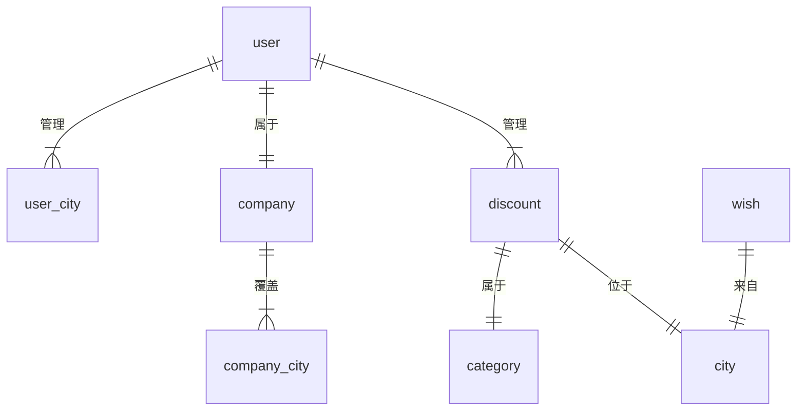
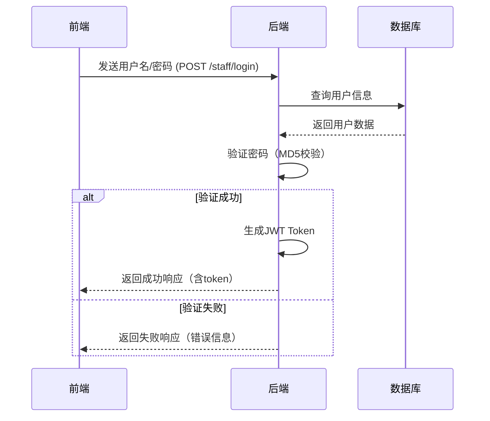
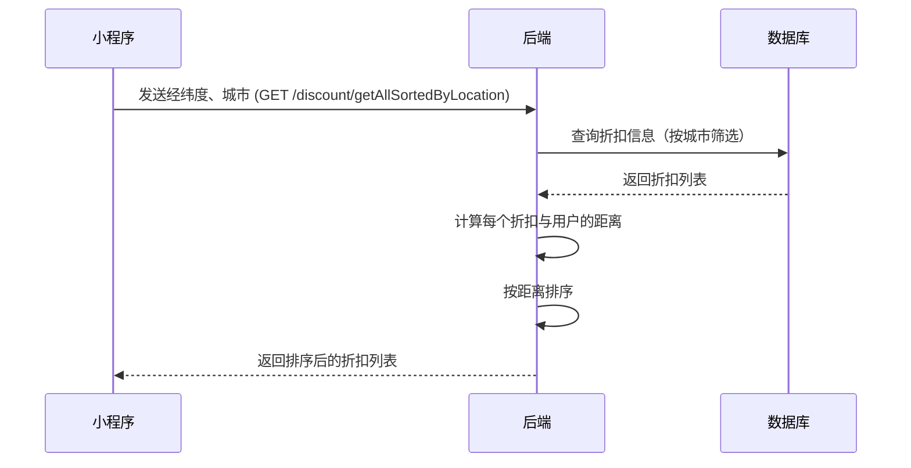
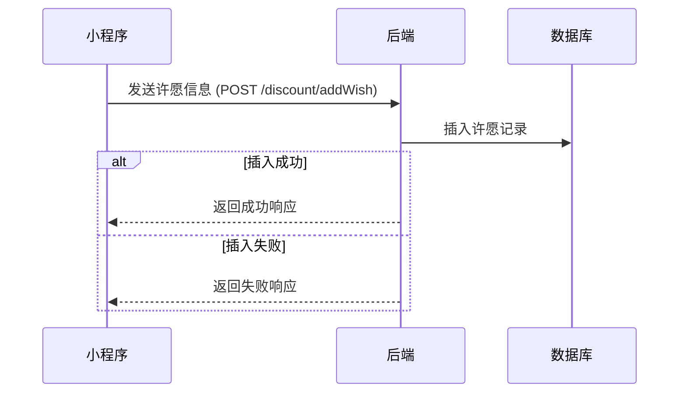

# 员工折扣系统 (Staff Discount System) 后端API分析

## 1. 项目概述

这是一个基于 **Spring Boot 2.2.4** 的员工折扣管理系统后端API，采用 **MyBatis** 作为ORM框架，**MySQL** 作为数据库。该系统主要分为两个面向的功能模块：
- **小程序端 (/discount)**：为员工用户提供折扣查询、许愿等功能
- **管理后台端 (/staff)**：为管理员提供用户管理、折扣管理、数据统计等功能

---

## 2. 核心功能模块

### 2.1 功能架构图

```mermaid
graph TD
    A[员工折扣系统API] --> B[小程序端接口 /discount]
    A --> C[管理后台接口 /staff]

    B --> B1[折扣查询]
    B1 --> B1a[获取所有折扣]
    B1 --> B1b[按位置排序获取折扣]
    B1 --> B1c[获取折扣详情]
    B --> B2[城市与分类]
    B2 --> B2a[获取城市列表]
    B2 --> B2b[获取分类列表]
    B --> B3[微信登录]
    B --> B4[许愿功能]

    C --> C1[用户管理]
    C1 --> C1a[用户登录]
    C1 --> C1b[用户注册]
    C1 --> C1c[用户删除]
    C1 --> C1d[用户信息修改]
    C1 --> C1e[密码修改]
    C1 --> C1f[获取所有用户]
    C --> C2[公司管理]
    C2 --> C2a[获取公司列表]
    C2 --> C2b[添加公司]
    C2 --> C2c[删除公司]
    C2 --> C2d[编辑公司]
    C --> C3[折扣管理]
    C3 --> C3a[查询用户管理城市的折扣]
    C3 --> C3b[获取折扣详情]
    C3 --> C3c[添加折扣]
    C3 --> C3d[更新折扣]
    C3 --> C3e[删除折扣]
    C3 --> C3f[恢复已删除折扣]
    C3 --> C3g[修改折扣状态]
    C --> C4[数据管理]
    C4 --> C4a[获取许愿列表]
    C4 --> C4b[获取许愿统计]
    C4 --> C4c[城市管理]
    C --> C5[文件管理]
    C5 --> C5a[文件上传]
```



---

## 3. 数据模型与关系

### 3.1 核心数据模型

#### 3.1.1 StaffUser (员工用户)
```
属性：
- userId: 用户ID（主键）
- username: 用户名（唯一）
- password: 密码（MD5加密）
- city: 所属城市
- companyGroup: 所属公司组
- role: 角色
- createTime: 创建时间
- updateTime: 更新时间
- expireDate: 过期时间
- managedCities: 管理的城市列表（名称）
- managedCityCodes: 管理的城市代码列表
```

#### 3.1.2 Company (公司)
```
属性：
- companyId: 公司ID（主键）
- companyGroup: 公司组名称（唯一）
- companyCity: 公司所在城市（代码）
- cityCodes: 公司覆盖的城市代码列表
- cityNames: 公司覆盖的城市名称列表
```

#### 3.1.3 Discount (折扣信息)
```
属性：
- id: 折扣ID（主键）
- name: 折扣名称
- city: 城市（名称）
- category: 分类（名称）
- discount: 折扣力度
- detail: 折扣详情
- startDate: 开始日期
- endDate: 结束日期
- phoneNumber: 联系电话
- address: 地址
- introduction: 简介
- longitude: 经度
- latitude: 纬度
- iconUrl: 图标URL
- picUrl: 图片URL
- status: 状态（0-有效，其他-无效）
- barrierFree: 无障碍设施（0-无，1-有）
- creator: 创建者
- updater: 更新者
- createTime: 创建时间
- updateTime: 更新时间
- distance: 距离（计算字段，用于排序）
```

#### 3.1.4 Category (分类)
```
属性：
- categoryId: 分类ID（主键）
- category: 分类名称
```

#### 3.1.5 City (城市)
```
属性：
- cityId: 城市ID（主键）
- city: 城市名称
- code: 城市代码（唯一）
```

#### 3.1.6 Wish (许愿/需求)
```
属性：
- count: 计数
- wishDesc: 许愿描述
- createTime: 创建时间
- wishCategory: 许愿分类
- city: 城市
- openId: 微信openId
- sametimeName: 同时期名称
- wishOtherInfo: 其他信息
```

#### 3.1.7 关联表

**UserCity (用户-城市关联)**
```
属性：
- userId: 用户ID
- city: 城市代码
- editable: 是否可编辑
```

**CompanyCity (公司-城市关联)**
```
属性：
- companyId: 公司ID
- city: 城市代码
```

---

### 3.2 数据关系图



---

## 4. API 接口清单

### 4.1 小程序端接口 (/discount)

| 接口路径 | 方法 | 功能描述 | 需登录 |
|---------|------|---------|--------|
| /discount/getAll | GET | 获取所有折扣列表 | 否 |
| /discount/getAllSortedByLocation | GET | 按位置排序获取折扣（需经纬度） | 否 |
| /discount/getCity | GET | 获取城市列表 | 否 |
| /discount/getCategory | GET | 获取分类列表 | 否 |
| /discount/detail | GET | 获取折扣详情 | 否 |
| /discount/login | GET | 微信登录（换取openId） | 否 |
| /discount/addWish | POST | 添加许愿 | 否 |

### 4.2 管理后台接口 (/staff)

#### 4.2.1 用户管理

| 接口路径 | 方法 | 功能描述 | 需登录 |
|---------|------|---------|--------|
| /staff/login | POST | 用户登录（返回token） | 否 |
| /staff/register | POST | 注册新用户 | 是 |
| /staff/deleteUser | POST | 删除用户 | 是 |
| /staff/userChangeCity | POST | 修改用户管理的城市 | 是 |
| /staff/changepswd | POST | 修改密码 | 是 |
| /staff/editUser | POST | 编辑用户信息 | 是 |
| /staff/allUser | GET | 获取所有用户列表 | 是 |
| /staff/userDetail | POST | 获取用户详情 | 是 |

#### 4.2.2 公司管理

| 接口路径 | 方法 | 功能描述 | 需登录 |
|---------|------|---------|--------|
| /staff/getCompanies | GET | 获取公司列表 | 是 |
| /staff/addCompany | POST | 添加公司 | 是 |
| /staff/delCompany | POST | 删除公司 | 是 |
| /staff/editCompany | POST | 编辑公司 | 是 |

#### 4.2.3 折扣管理

| 接口路径 | 方法 | 功能描述 | 需登录 |
|---------|------|---------|--------|
| /staff/queryUserDiscounts | GET | 查询用户管理城市的折扣 | 是 |
| /staff/discount/detail | GET | 获取折扣详情 | 是 |
| /staff/discount/propose | GET | 获取折扣查询前的数据（城市、分类） | 是 |
| /staff/getAllDeleted | GET | 获取已删除的折扣列表 | 是 |
| /staff/insert | POST | 添加折扣 | 是 |
| /staff/update | POST | 更新折扣 | 是 |
| /staff/deleteOne | GET | 删除折扣 | 是 |
| /staff/restoreOne | GET | 恢复已删除的折扣 | 是 |
| /staff/changeStatus | GET | 更改折扣状态 | 是 |

#### 4.2.4 数据管理

| 接口路径 | 方法 | 功能描述 | 需登录 |
|---------|------|---------|--------|
| /staff/getWishList | GET | 获取许愿列表（支持日期筛选） | 是 |
| /staff/getWishCount | GET | 获取许愿统计 | 是 |
| /staff/allCities | GET | 获取所有城市 | 是 |
| /staff/addCity | POST | 添加城市 | 是 |
| /staff/deleteCity | POST | 删除城市 | 是 |

#### 4.2.5 文件管理

| 接口路径 | 方法 | 功能描述 | 需登录 |
|---------|------|---------|--------|
| /file/upload | POST | 文件上传到阿里云OSS | 是 |

---

## 5. 核心业务流程

### 5.1 用户登录流程



### 5.2 折扣查询流程（按位置排序）



### 5.3 许愿流程



---

## 6. 认证与授权

- **认证方式**：JWT (JSON Web Token)
- **令牌生成**：登录时由后端生成，包含用户名信息
- **令牌验证**：通过 `AuthorizationInterceptor` 拦截器验证请求头中的 token
- **权限控制**：使用 `@Login` 注解标记需要登录的接口
- **密码加密**：MD5加密（UTF-8编码）

---

## 7. 数据存储

### 7.1 数据库架构

该系统使用 **MySQL** 数据库，主要表包括：
- `user`：用户表
- `company`：公司表
- `company_city`：公司城市关联表
- `user_city`：用户城市关联表
- `discount`：折扣表
- `discount_deleted`：已删除折扣表
- `category`：分类表
- `city`：城市表
- `wish`：许愿表

### 7.2 文件存储

- **文件上传**：使用阿里云 OSS (Object Storage Service)
- **支持格式**：图片、文档等
- **访问方式**：通过生成的URL访问

---

## 8. 技术栈与依赖

### 8.1 核心框架
- **Spring Boot 2.2.4**：Web应用框架
- **MyBatis 2.1.0**：ORM框架
- **MySQL Connector 8.2.0**：MySQL驱动

### 8.2 主要依赖
- **JWT (io.jsonwebtoken) 0.9.0**：Token生成与验证
- **FastJSON 1.2.83**：JSON处理
- **阿里云OSS SDK 3.8.0**：文件存储
- **Apache Commons IO 2.14.0**：IO操作
- **Apache Commons Lang3**：工具类库

---

## 9. 系统特点与优势

1. **双端支持**：同时提供小程序端和管理后台端API
2. **位置服务**：支持按距离排序的折扣查询
3. **权限管理**：基于角色的访问控制
4. **数据安全**：密码加密存储，Token认证
5. **文件存储**：集成阿里云OSS，支持大容量存储
6. **微信集成**：支持微信小程序登录
7. **数据统计**：提供许愿数据统计功能

---

## 10. 潜在优化点

1. **密码加密**：建议使用更安全的加密算法（如BCrypt）替代MD5
2. **Token过期**：当前Token无过期时间，建议添加过期机制
3. **输入验证**：增强参数验证，防止SQL注入等攻击
4. **API文档**：建议添加Swagger等API文档工具
5. **缓存机制**：对常用数据（如城市、分类）添加缓存
6. **错误处理**：统一错误处理机制

---

## 11. 总结

该员工折扣系统后端API设计清晰，功能完整，覆盖了用户管理、公司管理、折扣管理和数据统计等核心业务需求。系统采用了主流的Spring Boot + MyBatis技术栈，集成了微信登录和阿里云OSS存储，为小程序端和管理后台端提供了稳定的接口服务。

虽然系统在功能上已基本完善，但在安全性和性能方面仍有优化空间，特别是密码加密和Token管理等方面。
