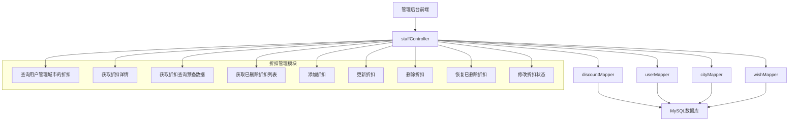
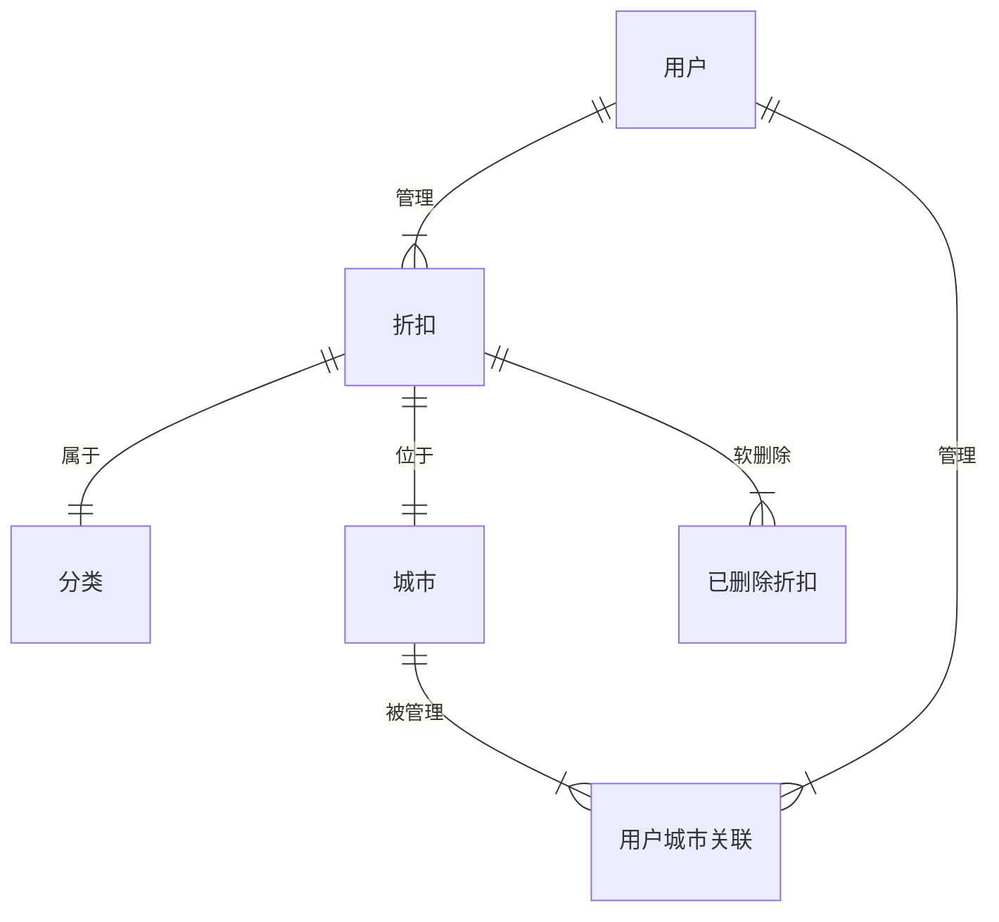
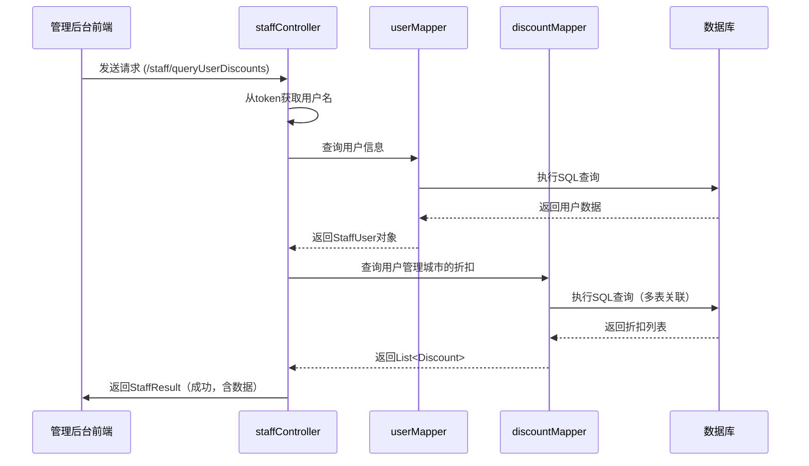
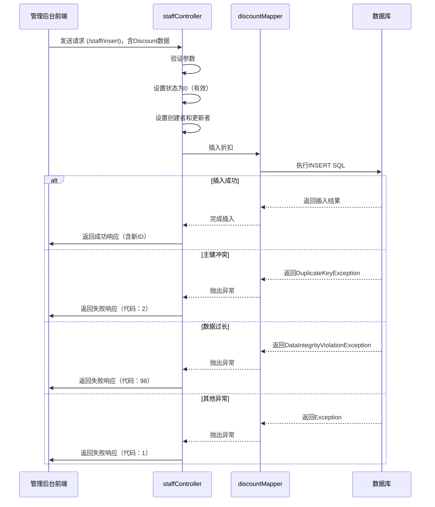
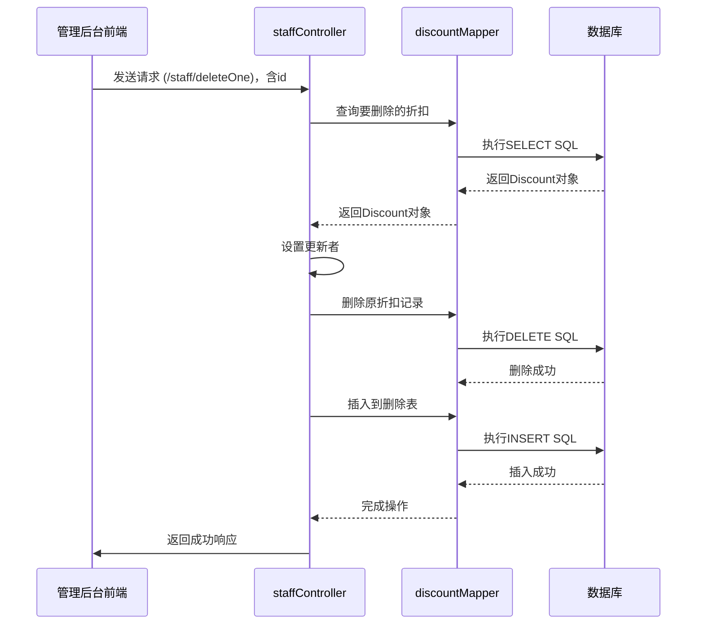

# 员工折扣系统管理后台API详细实现分析

## 1. 项目概述

本分析文档重点关注 `vendor/staffdiscount/api` 中管理后台 `/staff` 路径下的折扣管理相关API的具体实现细节。这些API由 `staffController` 类提供，负责处理管理员对折扣信息的增删改查等操作。

---

## 2. 折扣管理API架构



---

## 3. 核心API详细实现

### 3.1 查询用户管理城市的折扣

#### 接口信息
- **路径**：`/staff/queryUserDiscounts`
- **方法**：GET
- **需登录**：是
- **返回类型**：StaffResult（包含折扣列表）

#### 实现代码分析

```java
@Login
@ResponseBody
@RequestMapping("/queryUserDiscounts")
public StaffResult getAllDiscount(HttpServletResponse response,HttpServletRequest request){
    logger.info("[getAllDiscount][List<discount>][staff-facing][path=/getAll]");
    StaffResult result = new StaffResult("0", "");
    try{
        String username = (String) request.getAttribute("username");
        StaffUser user = userMapper.getUserByName(username);
        if(user == null){
            result.setMessage("Session Expired");
            result.setStatus("1");
            result.setListData(new ArrayList<Discount>());
        } else {
            List<Discount> discounts = discountMapper.queryDiscountsByUserCity(user.getUserId());
            result.setListData(discounts);
        }
    }catch(Exception ex){
        logger.info("[getAllDiscount][List<discount>][staff-facing][path=/getAll][Exception " + ex.toString() + "]");
        result.setStatus("1");
        result.setMessage("Can't get discount list.");
        result.setListData( new ArrayList<Discount>());

    }
    return result;
}
```

#### 关键技术点
1. **会话管理**：从 `HttpServletRequest` 中获取用户名，需配合 `AuthorizationInterceptor` 使用
2. **权限验证**：使用 `@Login` 注解确保只有登录用户可以访问
3. **数据过滤**：根据用户ID查询其管理城市的折扣
4. **异常处理**：完善的错误日志记录和异常处理机制
5. **结果封装**：使用 `StaffResult` 统一返回格式

#### SQL查询（discountMapper.queryDiscountsByUserCity）

```sql
SELECT
    id, discount.city, name, discount, introduction, discount_detail,
    start_date, end_date, address, phone_number, longitude, latitude,
    pic_url, icon_url, barrier_free, status, creator, updater, update_time,
    create_time, category.category as 'category'
FROM discount
JOIN category ON discount.category = category.category_id
JOIN city ON city.city = discount.city
JOIN user_city ON user_city.city = city.code
WHERE user_city.user_id = #{userId}
ORDER BY discount.id DESC
```

---

### 3.2 获取折扣详情

#### 接口信息
- **路径**：`/staff/discount/detail`
- **方法**：GET
- **需登录**：是
- **参数**：id（折扣ID）
- **返回类型**：StaffResult（包含单个折扣对象）

#### 实现代码分析

```java
@Login
@ResponseBody
@RequestMapping("/discount/detail")
public StaffResult getDiscountDetail(HttpServletResponse response,HttpServletRequest request, int id){
    logger.info("[getDiscountDetail][Discount][staff-facing][path=/discount/detail]");
    StaffResult result = new StaffResult("0", "");
    try{
        Discount discounts = discountMapper.getDetail(id);
        result.setObjData(discounts);

    }catch(Exception ex){
        logger.info("[getDiscountDetail][Discount][staff-facing][path=/discount/detail][Exception " + ex.toString() + "]");
        result.setStatus("1");
        result.setMessage("Can't get discount detail.");
    }
    return result;
}
```

#### SQL查询（discountMapper.getDetail）

```sql
SELECT
    id, city, category.category as 'category', name, discount, introduction,
    discount_detail, start_date, end_date, address, phone_number, longitude,
    latitude, pic_url, icon_url, barrier_free, creator, updater, update_time,
    create_time, status
FROM discount
JOIN category ON discount.category = category.category_id
WHERE discount.id = #{id}
```

---

### 3.3 获取折扣查询预备数据

#### 接口信息
- **路径**：`/staff/discount/propose`
- **方法**：GET
- **需登录**：是
- **返回类型**：StaffResult（包含城市列表和分类列表）

#### 实现代码分析

```java
@Login
@ResponseBody
@RequestMapping("/discount/propose")
public StaffResult discountListPropose() {
    logger.info("[discountListPropose][ArrayList][staff-facing][path=/discount/propose]");

    StaffResult result = new StaffResult("0", "");
    List<Object> data = new ArrayList<Object>(2);
    try{
        data.add(cityMapper.getCity());
        data.add(discountMapper.getCategory());
        result.setListData(data);
    }catch(Exception e){
        logger.info("[discountListPropose][ArrayList][staff-facing][path=/discount/propose][Exception " + e.toString() + "]");
        result.setStatus("1");
        result.setMessage("Propose discount failed");
        data.add(new ArrayList<City>());
        data.add(new ArrayList<Category>());
        result.setListData(data);
    }
    return result;
}
```

#### 功能说明
- 获取城市列表和分类列表
- 用于在添加或查询折扣时提供选项
- 两个列表被封装在一个 `ArrayList<Object>` 中返回

---

### 3.4 获取已删除折扣列表

#### 接口信息
- **路径**：`/staff/getAllDeleted`
- **方法**：GET
- **需登录**：是
- **返回类型**：StaffResult（包含已删除折扣列表）

#### 实现代码分析

```java
@Login
@ResponseBody
@RequestMapping("/getAllDeleted")
public StaffResult getDeletedList(HttpServletResponse response){
    logger.info("[getDeletedList][List<discount>][staff-facing][path=/getAllDeleted]");
    StaffResult result = new StaffResult("0", "");

    try{
        List<Discount> discounts = discountMapper.getDeletedList();
        result.setListData(discounts);
    }catch(Exception e){
        logger.info("[getDeletedList][List<discount>][staff-facing][path=/getAllDeleted][Exception " + e.toString() + "]");
        result.setListData(new ArrayList<Discount>());;
    }
    return result;
}
```

#### SQL查询（discountMapper.getDeletedList）

```sql
SELECT * FROM discount_deleted
```

---

### 3.5 添加折扣

#### 接口信息
- **路径**：`/staff/insert`
- **方法**：POST
- **需登录**：是
- **参数**：Discount对象（包含所有折扣属性）
- **返回类型**：StaffResult（包含新添加折扣的ID）

#### 实现代码分析

```java
@Login
@ResponseBody
@RequestMapping(value = "/insert",method = POST)
public StaffResult insertDiscount(HttpServletRequest request, @Validated Discount discount){
    logger.info("Begin insert new Discount object.");
    try{
        String username = (String) request.getAttribute("username");
        logger.info("[insertDiscount][StaffResult][staff-facing][path=/insert][username="+username+"]");
        discount.setStatus(0);
        discount.setCreator(username);
        discount.setUpdater(username);
        discountMapper.insert(discount);
    }
    catch(DuplicateKeyException e){
        logger.info(e.toString());
        logger.info("[insertDiscount][StaffResult][staff-facing][code=2][Duplicated Key]");
        return new StaffResult("2","User Duplicated.");
    }
    catch(DataIntegrityViolationException e) {
        logger.info(e.toString());
        logger.info("[insertDiscount][StaffResult][staff-facing][code=98][insert too long ->"+ discount.toString().substring(0, 100) + "]");
        return new StaffResult("98","Data too long.");
    }
    catch (Exception e){
        logger.info(e.toString());
        return new StaffResult("1","Insert failed.");
    }

    StaffResult sr = new StaffResult("0","Success");
    sr.setNewId(discount.getId());
    return sr;
}
```

#### 关键技术点
1. **参数验证**：使用 `@Validated` 注解进行参数验证
2. **状态设置**：新添加的折扣状态默认为0（有效）
3. **操作记录**：设置创建者和更新者为当前登录用户
4. **异常处理**：
   - DuplicateKeyException：处理主键冲突
   - DataIntegrityViolationException：处理数据长度超限
   - 其他异常：统一处理为插入失败

#### SQL操作（discountMapper.insert）

```sql
INSERT INTO discount(
    id, city, category, name, discount, introduction, discount_detail,
    start_date, end_date, address, phone_number, longitude, latitude,
    pic_url, icon_url, status, barrier_free, creator, updater
) VALUES(
    #{id}, #{city}, #{category}, #{name}, #{discount}, #{introduction}, #{detail},
    #{startDate}, #{endDate}, #{address}, #{phoneNumber}, #{longitude}, #{latitude},
    #{picUrl}, #{iconUrl}, #{status}, #{barrierFree}, #{creator}, #{updater}
)
```

---

### 3.6 更新折扣

#### 接口信息
- **路径**：`/staff/update`
- **方法**：POST
- **需登录**：是
- **参数**：Discount对象（包含所有折扣属性）
- **返回类型**：StaffResult（更新结果）

#### 实现代码分析

```java
@Login
@ResponseBody
@RequestMapping(value = "/update",method = POST)
public StaffResult updateDiscount(HttpServletRequest request, @Validated Discount discount){
    logger.info("Begin update Discount object.");
    try{
        String username = (String) request.getAttribute("username");
        logger.info("[updateDiscount][StaffResult][staff-facing][path=/update][username="+username+"]");
        discount.setCreator(discountMapper.getOne(discount.getId()).getCreator());
        discount.setUpdater(username);
        discountMapper.update(discount);
    }
    catch(DataIntegrityViolationException e) {
        logger.info(e.toString());
        logger.info("[updateDiscount][StaffResult][staff-facing][code=98][update too long ->"+ discount.toString().substring(0, 100) + "]");
        return new StaffResult("98","Data too long.");
    }
    catch (Exception e){
        logger.info(e.toString());
        return new StaffResult("1","Update failed.");
    }

    return new StaffResult("0","Success.");
}
```

#### 关键技术点
1. **保持创建者信息**：更新时保留原始创建者信息
2. **操作记录**：设置更新者为当前登录用户
3. **数据验证**：使用 `@Validated` 注解进行参数验证

#### SQL操作（discountMapper.update）

```sql
UPDATE discount SET
    city=#{city}, category=#{category}, name=#{name}, discount=#{discount},
    introduction=#{introduction}, discount_detail=#{detail}, start_date=#{startDate},
    end_date=#{endDate}, address=#{address}, phone_number=#{phoneNumber},
    longitude=#{longitude}, latitude=#{latitude}, pic_url=#{picUrl},
    icon_url=#{iconUrl}, status=#{status}, barrier_free=#{barrierFree},
    creator=#{creator}, updater=#{updater}
WHERE id = #{id}
```

---

### 3.7 删除折扣

#### 接口信息
- **路径**：`/staff/deleteOne`
- **方法**：GET
- **需登录**：是
- **参数**：id（折扣ID）
- **返回类型**：StaffResult（删除结果）

#### 实现代码分析

```java
@Login
@ResponseBody
@RequestMapping(value = "/deleteOne", method = GET)
public StaffResult deleteDiscount(HttpServletRequest request, @RequestParam int id){
    logger.info("Begin delete one Discount.");
    try{
        Discount discount = discountMapper.getOne(id);
        String username = (String) request.getAttribute("username");
        logger.info("[deleteDiscount][StaffResult][staff-facing][path=/deleteOne][username="+username+"]");
        discount.setUpdater(username);
        discountMapper.delete(id);
        discountMapper.insert_deleted(discount);
    }
    catch (Exception e){
        logger.info(e.toString());
        return new StaffResult("1","Delete failed");
    }
    logger.info("delete\tid="+id);
    return new StaffResult("0","Success");
}
```

#### 关键技术点
1. **软删除机制**：不是真正删除数据，而是将其移到 `discount_deleted` 表中
2. **操作记录**：设置更新者为当前登录用户
3. **日志记录**：详细记录删除操作的日志

#### SQL操作
- **删除**：`DELETE FROM discount WHERE id = #{id}`
- **插入到删除表**：
```sql
INSERT INTO discount_deleted(
    id, city, category, name, discount, introduction, discount_detail,
    start_date, end_date, address, phone_number, longitude, latitude,
    pic_url, icon_url, status, barrier_free, creator, updater
) VALUES(
    #{id}, #{city}, #{category}, #{name}, #{discount}, #{introduction}, #{detail},
    #{startDate}, #{endDate}, #{address}, #{phoneNumber}, #{longitude}, #{latitude},
    #{picUrl}, #{iconUrl}, #{status}, #{barrierFree}, #{creator}, #{updater}
)
```

---

### 3.8 恢复已删除折扣

#### 接口信息
- **路径**：`/staff/restoreOne`
- **方法**：GET
- **需登录**：是
- **参数**：id（折扣ID）
- **返回类型**：StaffResult（恢复结果）

#### 实现代码分析

```java
@Login
@ResponseBody
@RequestMapping(value = "/restoreOne", method = GET)
public StaffResult restoreDiscount(HttpServletRequest request, @RequestParam int id){
    logger.info("Begin restore one Discount.");
    try{
        Discount discount = discountMapper.getOne_deleted(id);
        discount.setStatus(0);
        String username = (String) request.getAttribute("username");
        logger.info("[restoreDiscount][StaffResult][path=/restoreOne][username="+username+"]");
        discount.setUpdater(username);
        discountMapper.insert(discount);
        discountMapper.delete_deleted(id);
        logger.info("restore\tid="+id);
    }
    catch (Exception e){
        logger.info(e.toString());
        return new StaffResult("1","Restore failed");
    }
    return new StaffResult("0","Success");
}
```

#### 关键技术点
1. **恢复逻辑**：从 `discount_deleted` 表中查询数据并插入回 `discount` 表
2. **状态设置**：恢复后的折扣状态默认为0（有效）
3. **操作记录**：设置更新者为当前登录用户

---

### 3.9 修改折扣状态

#### 接口信息
- **路径**：`/staff/changeStatus`
- **方法**：GET
- **需登录**：是
- **参数**：id（折扣ID），status（状态值）
- **返回类型**：StaffResult（修改结果）

#### 实现代码分析

```java
@Login
@ResponseBody
@RequestMapping(value = "/changeStatus", method = GET)
public StaffResult changeDiscountStatus(HttpServletRequest request, @RequestParam int id, @RequestParam int status){
    try{
        Discount discount = discountMapper.getOne(id);
        discount.setStatus(status);
        String username = (String) request.getAttribute("username");
        logger.info("[changeDiscountStatus][StaffResult][path=/changeStatus][username="+username+"]");
        discount.setUpdater(username);
        discountMapper.update(discount);
    }
    catch (Exception e){
        logger.info(e.toString());
        return new StaffResult("1", "Update status failed");
    }
    logger.info("changeStatus\tid="+id+"\tstatus="+status);
    return new StaffResult("0","Success");
}
```

#### 功能说明
- 修改折扣的状态，通常用于激活或停用折扣
- 状态值说明：0表示有效，其他值表示无效

---

## 4. 数据库表结构

### 4.1 折扣主表（discount）

| 字段名 | 类型 | 说明 |
|-------|------|------|
| id | int | 主键，自增 |
| city | varchar | 城市名称 |
| category | int | 分类ID（关联category表） |
| name | varchar | 折扣名称 |
| discount | varchar | 折扣力度 |
| introduction | varchar | 简介 |
| discount_detail | text | 详细说明 |
| start_date | date | 开始日期 |
| end_date | date | 结束日期 |
| address | varchar | 地址 |
| phone_number | varchar | 联系电话 |
| longitude | double | 经度 |
| latitude | double | 纬度 |
| pic_url | varchar | 图片URL |
| icon_url | varchar | 图标URL |
| status | int | 状态：0-有效，其他-无效 |
| barrier_free | int | 无障碍设施：0-无，1-有 |
| creator | varchar | 创建者 |
| updater | varchar | 更新者 |
| create_time | datetime | 创建时间 |
| update_time | datetime | 更新时间 |

### 4.2 已删除折扣表（discount_deleted）

与 `discount` 表结构相同，用于存储已删除的折扣记录。

### 4.3 分类表（category）

| 字段名 | 类型 | 说明 |
|-------|------|------|
| category_id | int | 主键，自增 |
| category | varchar | 分类名称 |

### 4.4 城市表（city）

| 字段名 | 类型 | 说明 |
|-------|------|------|
| city_id | int | 主键，自增 |
| city | varchar | 城市名称 |
| code | varchar | 城市代码 |

---

## 5. 数据关系图



---

## 6. 核心业务流程

### 6.1 折扣查询流程



### 6.2 折扣添加流程



### 6.3 折扣删除流程



---

## 7. 技术特点与优势

### 7.1 架构设计
- **分层架构**：控制器层→数据访问层→数据库，职责清晰
- **模块化设计**：折扣管理功能独立成模块，可维护性强

### 7.2 安全性
- **会话管理**：使用JWT Token进行身份验证
- **权限控制**：所有API都需要登录后才能访问
- **参数验证**：使用 `@Validated` 注解进行参数验证

### 7.3 数据完整性
- **软删除机制**：删除操作不会真正删除数据，而是移到删除表
- **操作记录**：每个折扣记录都包含创建者和更新者信息
- **数据验证**：对关键数据有长度和格式限制

### 7.4 性能优化
- **索引优化**：SQL查询中使用了适当的关联和索引
- **查询优化**：根据用户权限过滤数据，减少返回数据量

### 7.5 异常处理
- **全面的异常捕获**：捕获并处理各种可能的异常
- **详细的日志记录**：每个操作都有详细的日志记录
- **统一的错误响应**：使用StaffResult统一返回格式

---

## 8. 潜在优化点

### 8.1 性能优化
- **添加缓存**：对城市列表和分类列表进行缓存，减少数据库查询
- **分页查询**：对大量折扣数据实现分页查询
- **索引优化**：对常用查询字段添加索引

### 8.2 功能优化
- **批量操作**：支持批量添加、更新、删除折扣
- **搜索功能**：添加按名称、城市、分类搜索折扣的功能
- **导出功能**：支持将折扣数据导出为Excel或CSV格式

### 8.3 安全性优化
- **权限细化**：根据角色细分权限，不同用户可操作的折扣范围不同
- **参数验证增强**：对所有输入参数进行更严格的验证
- **防止SQL注入**：使用参数化查询，避免SQL注入

### 8.4 代码优化
- **错误信息优化**：提供更具体的错误信息，方便调试
- **代码重构**：将重复的代码提取为公共方法
- **文档完善**：添加更多的注释和API文档

---

## 9. 总结

管理后台的折扣管理API提供了完整的增删改查功能，实现了权限控制、数据验证和异常处理等功能。代码结构清晰，分层明确，符合Spring Boot最佳实践。

通过软删除机制和操作记录功能，确保了数据的安全性和可追溯性。虽然系统已经具备了基本的功能，但在性能优化、功能扩展和安全性方面仍有改进空间。
