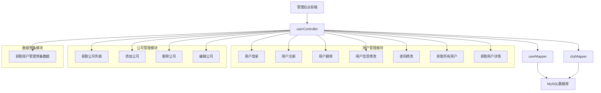
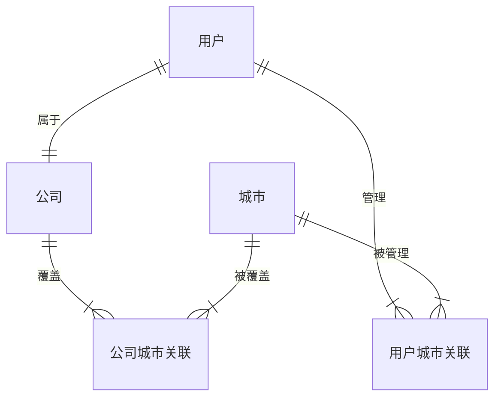
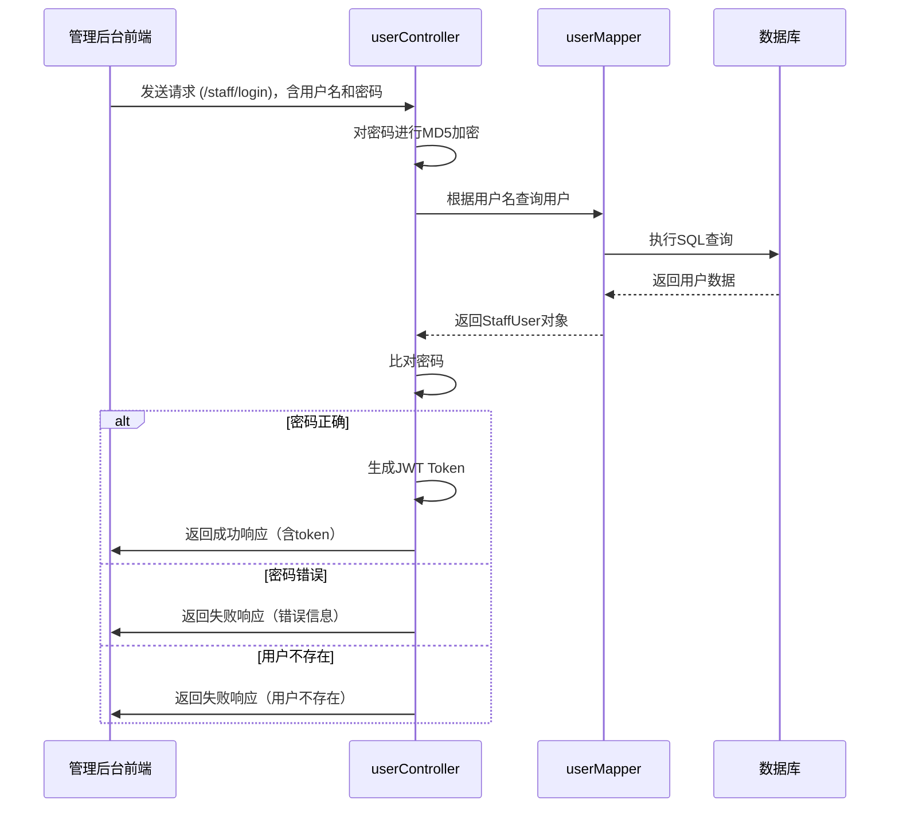
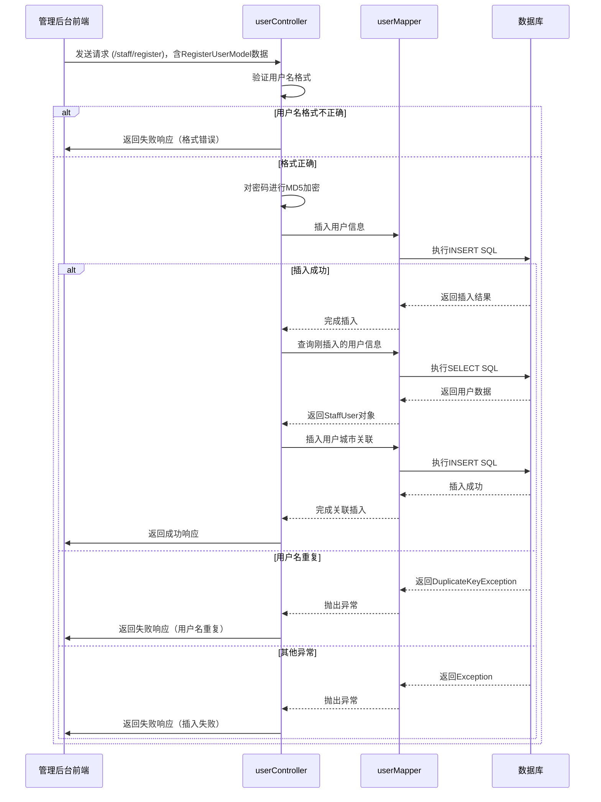
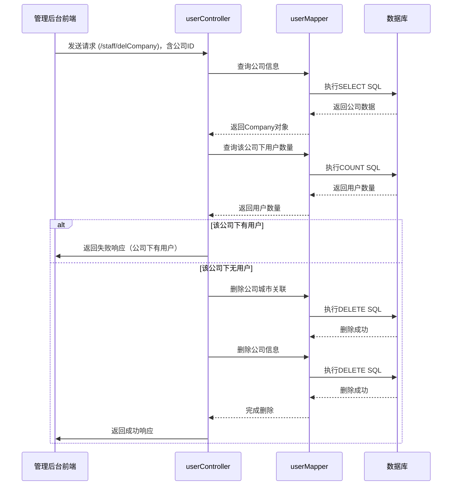

# 员工折扣系统管理后台用户管理API详细实现分析

## 1. 项目概述

本分析文档重点关注 `vendor/staffdiscount/api` 中管理后台 `/staff` 路径下的用户管理相关API的具体实现细节。这些API由 `userController` 类提供，负责处理管理员对用户信息的增删改查等操作，以及公司管理功能。

---

## 2. 用户管理API架构



---

## 3. 核心API详细实现

### 3.1 用户登录

#### 接口信息
- **路径**：`/staff/login`
- **方法**：POST
- **需登录**：否
- **参数**：username（用户名），password（密码）
- **返回类型**：LoginResult（包含token）

#### 实现代码分析

```java
@RequestMapping(value = "/login", method = POST)
public LoginResult login(final HttpServletResponse response, @RequestParam final String username,
        @RequestParam final String password) throws NoSuchAlgorithmException {
    logger.info("[login][LoginResult][path=/login][begin]");
    final String pswd = MD5EncodeUtf8(password);
    try {
        final StaffUser user = userMapper.getUserByName(username);
        if (pswd.equals(user.getPassword())) {
            logger.info("[login][LoginResult][path=/login][login\tSuccessfully\t" + username + "]");
            final String accessToken = TokenUtil.createJwtToken(username);
            final LoginResult result = new LoginResult("0", "Success");
            result.setRole(user.getRole());
            result.setCompanyGroup(user.getCompanyGroup());
            result.setToken(accessToken);
            return result;
        } else {
            logger.info("[login][LoginResult][path=/login][Login failed\tIncorrect Password:" + username + "]");
            final LoginResult result = new LoginResult("1", "Username or Password Incorrect!");
            result.setRole("");
            result.setCompanyGroup("");
            result.setToken("");
            return result;
        }
    } catch (final Exception e) {
        logger.info("[login][LoginResult][path=/login][login failed\tUser Not Found:" + username + "]");
        logger.info(e.toString());
        final LoginResult result = new LoginResult("2", "User Not Found");
        result.setRole("");
        result.setCompanyGroup("");
        result.setToken("");
        return result;
    }
}
```

#### 关键技术点
1. **密码加密**：使用MD5加密算法加密密码（UTF-8编码）
2. **密码验证**：查询数据库中的用户并比对密码
3. **Token生成**：使用JWT生成访问令牌，包含用户名信息
4. **响应格式**：使用LoginResult封装返回结果，包含角色、公司组和token
5. **异常处理**：处理用户不存在、密码错误等异常

#### SQL查询（userMapper.getUserByName）

```sql
SELECT * FROM user WHERE username = #{username}
```

---

### 3.2 用户注册

#### 接口信息
- **路径**：`/staff/register`
- **方法**：POST
- **需登录**：是
- **参数**：RegisterUserModel对象（包含用户名、密码、角色、公司组、管理城市等）
- **返回类型**：StaffResult（注册结果）

#### 实现代码分析

```java
@Login
@RequestMapping(value = "/register", method = POST)
public StaffResult register(final HttpServletResponse response, final RegisterUserModel userModel) {
    logger.info("[register][StaffResult][path=/register][begin]");
    final String pswd = MD5EncodeUtf8(userModel.getPassword());

    if(!userModel.isUserNameValid()) {
        logger.info("[register][StaffResult][path=/register][Username format incorrect.]");
        return new StaffResult("3", "Username format incorrect.");
    }

    final StaffUser insertUser = userModel.getInsertUser();
    try {
        insertUser.setPassword(pswd);
        userMapper.insert(insertUser);
        final StaffUser insertedUser = userMapper.getUserByName(insertUser.getUsername());

        if (insertedUser.getUserId() > 0) {
            final List<String> cities = userModel.getManagedCities();
            final int userId = insertedUser.getUserId();
            insertUser.setUserId(userId);
            final int size = cities.size();
            logger.info("[register][city size][" + size + "]");
            for (int i = 0; i < size; i++) {
                final String city = cities.get(i);
                logger.info("[register][city code][" + city + "]");
                final UserCity uc = new UserCity(userId, city, "1");
                userMapper.addUserCity(uc);
            }
        } else {
            throw new InsertUserException("Can't get new userId.");
        }
    } catch (final DuplicateKeyException sqlE) {
        logger.info("[register][failed][" + sqlE.toString() + "]");
        return new StaffResult("2", "Username duplicated.");
    } catch (final Exception e) {
        logger.info("[register][failed][" + e.toString() + "]");
        return new StaffResult("1", "Something went wrong.");
    }
    logger.info("register\tSuccessfully\t" + insertUser.getUsername());
    return new StaffResult("0", "Success.");
}
```

#### 关键技术点
1. **用户名格式验证**：使用RegisterUserModel.isUserNameValid()方法验证用户名格式
2. **密码加密**：使用MD5加密密码
3. **用户插入**：先插入用户基本信息，再插入用户管理的城市关联
4. **异常处理**：
   - DuplicateKeyException：处理用户名重复
   - InsertUserException：处理获取用户ID失败
   - 其他异常：统一处理为插入失败

#### SQL操作
- **插入用户**：
```sql
INSERT INTO user(username, password, city, company_group, role)
VALUES(#{username}, #{password}, #{city}, #{companyGroup}, #{role})
```
- **插入用户城市关联**：
```sql
INSERT INTO user_city(user_id, city, editable)
VALUES(#{userId}, #{city}, #{editable})
```

---

### 3.3 用户删除

#### 接口信息
- **路径**：`/staff/deleteUser`
- **方法**：POST
- **需登录**：是
- **参数**：userId（用户ID）
- **返回类型**：StaffResult（删除结果）

#### 实现代码分析

```java
@Login
@RequestMapping(value = "/deleteUser", method = POST)
public StaffResult deleteStaffUser(final HttpServletResponse response, @RequestParam final int userId) {
    logger.info("[deleteStaffUser][StaffResult][path=/deleteUser][begin]");
    try {
        userMapper.deleteUserCityByUserId(userId);
        userMapper.deleteUser(userId);
    } catch (final Exception e) {
        logger.info(
                "[deleteStaffUser][StaffResult][path=/deleteUser][delete user failed, user_id = " + userId + "]");
        logger.info(e.toString());
        return new StaffResult("1", "Delete failed.");
    }
    logger.info("[deleteStaffUser][StaffResult][path=/deleteUser][deleted user\tSuccessfully\t user_id = " + userId
            + "]");
    return new StaffResult("0", "Success.");
}
```

#### 关键技术点
1. **级联删除**：先删除用户与城市的关联记录，再删除用户记录
2. **异常处理**：捕获并处理删除过程中的异常
3. **日志记录**：详细记录删除操作的日志

#### SQL操作
- **删除用户城市关联**：
```sql
DELETE FROM user_city WHERE user_id = #{userId}
```
- **删除用户**：
```sql
DELETE FROM user WHERE user_id = #{userId}
```

---

### 3.4 用户信息修改

#### 接口信息
- **路径**：`/staff/userChangeCity`
- **方法**：POST
- **需登录**：是
- **参数**：userId（用户ID），RegisterUserModel对象（包含更新后的用户信息）
- **返回类型**：StaffResult（修改结果）

#### 实现代码分析

```java
@Login
@RequestMapping(value = "/userChangeCity", method = POST)
public StaffResult userChangeCity(final HttpServletResponse response, @RequestParam final int userId,
        final RegisterUserModel updateUser) {
    logger.info("[userChangeCity][StaffResult][path=/userChangeCity][begin]");
    try {
        if (updateUser.getUserId() <= 0) {
            logger.info("[userChangeCity][StaffResult][path=/userChangeCity][CannotFindUserIdException]");
            throw new CannotFindUserIdException("Can't find user id from submit data.");
        }
        userMapper.deleteUserCityByUserId(userId);
        final String newPassword = updateUser.getPassword();

        final StaffUser newUserObj = updateUser.getInsertUser();
        if (newPassword != "") {
            final String hashedPassword = MD5EncodeUtf8(newPassword);
            newUserObj.setPassword(hashedPassword);
        }

        if (!newUserObj.getPassword().equals("")) {
            userMapper.updateCompanyGroupAndPassword(newUserObj);
        } else {
            userMapper.updateCompanyGroup(newUserObj);
        }

        final List<String> managedCities = updateUser.getManagedCities();
        final int size = managedCities.size();
        logger.info("[userChangeCity][city size][" + size + "]");
        for (int i = 0; i < size; i++) {
            final String city = managedCities.get(i);
            logger.info("[userChangeCity][city code][" + city + "]");
            final UserCity uc = new UserCity(userId, city, "1");
            userMapper.addUserCity(uc);
        }
    } catch (final Exception e) {
        logger.info(
                "[userChangeCity][StaffResult][path=/userChangeCity][Update User Exception][" + e.toString() + "]");
        return new StaffResult("1", e.toString());
    }
    logger.info("[userChangeCity][StaffResult][path=/userChangeCity][\t Update Success \t" + updateUser.getUserId()
            + "]");
    return new StaffResult("0", "Success");
}
```

#### 关键技术点
1. **用户ID验证**：检查提交的数据中是否包含有效的用户ID
2. **密码处理**：如果提交了新密码，则加密后更新，否则保留原密码
3. **城市关联更新**：先删除原有的城市关联，再插入新的关联
4. **更新方法选择**：根据是否有密码更新选择不同的更新方法

#### SQL操作
- **删除用户城市关联**：`DELETE FROM user_city WHERE user_id = #{userId}`
- **更新用户信息（含密码）**：
```sql
UPDATE user SET company_group=#{companyGroup}, role=#{role}, password=#{password}
WHERE user_id=#{userId}
```
- **更新用户信息（不含密码）**：
```sql
UPDATE user SET company_group=#{companyGroup}, role=#{role}
WHERE user_id=#{userId}
```
- **插入用户城市关联**：
```sql
INSERT INTO user_city(user_id, city, editable)
VALUES(#{userId}, #{city}, #{editable})
```

---

### 3.5 密码修改

#### 接口信息
- **路径**：`/staff/changepswd`
- **方法**：POST
- **需登录**：是
- **参数**：username（用户名），password（旧密码），newpswd（新密码）
- **返回类型**：StaffResult（修改结果）

#### 实现代码分析

```java
@Login
@RequestMapping(value = "/changepswd", method = POST)
public StaffResult changeUserPassword(final HttpServletResponse response, @RequestParam final String username,
        @RequestParam final String password, @RequestParam final String newpswd) {
    logger.info("[changeUserPassword][StaffResult][path=/changepswd][begin]");
    final String old_pswd = MD5EncodeUtf8(password);
    final String new_pswd = MD5EncodeUtf8(newpswd);

    try {
        final StaffUser user = userMapper.getUserByName(username);

        if (!old_pswd.equals(user.getPassword())) {
            logger.info("[changeUserPassword][StaffResult][path=/changepswd][Origin passwordd incorrect\t"
                    + username + "\t" + newpswd + "]");
            return new StaffResult("4", "Origin passwordd incorrect");
        }

        if (new_pswd.equals(user.getPassword())) {
            logger.info("[changeUserPassword][StaffResult][path=/changepswd][Duplicate password\t" + username + "\t"
                    + newpswd + "]");
            return new StaffResult("1", "Need a new password");
        }

        if (old_pswd.equals(user.getPassword())) {
            userMapper.changePswd(username, new_pswd);
            logger.info("[changeUserPassword][StaffResult][path=/changepswd][Updated password\t" + username + "\t"
                    + newpswd + "]");
            logger.info("changePassword\tSuccessfully\t" + username + "\t" + newpswd);
            return new StaffResult("0", "Password changed.");
        }
    } catch (final Exception e) {
        logger.info("[changeUserPassword][StaffResult][path=/changepswd][Generic exception: " + e.toString() + "]");
        return new StaffResult("2", "Username is not exists");
    }
    return new StaffResult("3", "Password is incorrect");
}
```

#### 关键技术点
1. **密码验证**：验证旧密码是否正确
2. **密码重复检查**：检查新密码是否与旧密码相同
3. **密码加密**：使用MD5加密新密码
4. **状态码说明**：
   - 0：成功
   - 1：新密码与旧密码相同
   - 2：用户名不存在
   - 3：密码不正确
   - 4：原密码不正确

#### SQL操作（userMapper.changePswd）

```sql
UPDATE user SET password=#{password} WHERE username=#{username}
```

---

### 3.6 获取所有用户

#### 接口信息
- **路径**：`/staff/allUser`
- **方法**：GET
- **需登录**：是
- **返回类型**：StaffResult（包含用户列表）

#### 实现代码分析

```java
@Login
@RequestMapping(value = "/allUser", method = GET)
public StaffResult getAllUsers(final HttpServletResponse response, final HttpServletRequest request) {
    logger.info("[getAllUsers][List<user>][path=/allUser][]");
    StaffResult result = new StaffResult("0","");

    try{
        final List<StaffUser> userList = userMapper.getAll();
        final int size = userList.size();
        for (int i = 0; i < size; i++) {
            final StaffUser oneUser = userList.get(i);
            final int userId = oneUser.getUserId();
            final List<String> userCityList = userMapper.getUserCityByUserId(userId);
            final List<String> userCityCodes = userMapper.getUserCityCodeByUserId(userId);
            oneUser.setManagedCities(userCityList);
            oneUser.setManagedCityCodes(userCityCodes);
        }
        result.setListData(userList);
    } catch (Exception ex) {
        logger.info("[getAllUsers][List<user>][path=/allUser][Exception][" + ex.toString() + "]");
        result.setStatus("1");
        result.setMessage("Can't get user list");
        result.setListData(new ArrayList<StaffUser>());
    }
    return result;
}
```

#### 关键技术点
1. **数据封装**：查询用户基本信息后，还要查询每个用户管理的城市信息并封装到StaffUser对象中
2. **城市信息获取**：分别获取城市名称和城市代码列表
3. **异常处理**：捕获并处理查询过程中的异常

#### SQL查询（userMapper.getAll）

```sql
SELECT user_id, username, c.city, create_time, update_time, company_group, role
FROM user
JOIN city c ON user.city = c.code
```

---

### 3.7 获取用户详情

#### 接口信息
- **路径**：`/staff/userDetail`
- **方法**：POST
- **需登录**：是
- **参数**：username（用户名）
- **返回类型**：StaffResult（包含用户详情）

#### 实现代码分析

```java
@Login
@RequestMapping(value = "/userDetail", method = POST)
public StaffResult getUserByName(final HttpServletResponse response, @RequestParam final String username) {
    logger.info("[getUserByName][class user][path=/searchOneUser][]");
    StaffResult result = new StaffResult("0","");
    try{
        StaffUser user = userMapper.getUserByName(username);
        user.setPassword("******");
        result.setObjData(user);
    }catch(Exception ex){
        logger.info("[getUserByName][class user][path=/searchOneUser][Exception][" + ex.toString() + "]");
        result.setStatus("1");
        result.setMessage("Can't get user details.");
    }

    return result;
}
```

#### 关键技术点
1. **密码脱敏**：返回用户详情时，将密码替换为星号(*)，保护用户隐私
2. **数据封装**：使用StaffResult封装返回结果
3. **异常处理**：捕获并处理查询过程中的异常

---

### 3.8 获取公司列表

#### 接口信息
- **路径**：`/staff/getCompanies`
- **方法**：GET
- **需登录**：是
- **返回类型**：StaffResult（包含公司列表）

#### 实现代码分析

```java
@Login
@RequestMapping(value = "/getCompanies", method = GET)
public StaffResult getCompanies() {
    logger.info("[getCompanies][List<company>][path=/getCompanies][]");

    StaffResult result = new StaffResult("0","");

    try {
        final List<Company> allCompanies = userMapper.getCompanies();

        final int size = allCompanies.size();

        for (int i = 0; i < size; i++) {
            final Company one = allCompanies.get(i);
            final int cid = one.getCompanyId();
            final List<String> cities = userMapper.getCompanyGroupCities(cid);
            final List<String> cityNames = userMapper.getCompanyCityStringByCompanyId(cid);

            if (cities.size() <= 0) {
                continue;
            }

            one.setCityCodes(cities);
            one.setCityNames(cityNames);
        }
        result.setListData(allCompanies);
    }catch(Exception ex){
        logger.info("[getCompanies][List<company>][path=/getCompanies][Exception][" + ex.toString() + "]");
        result.setStatus("1");
        result.setMessage("Can't get company list");
        result.setListData(new ArrayList<Company>());
    }

    return result;
}
```

#### 关键技术点
1. **数据封装**：查询公司基本信息后，还要查询每个公司覆盖的城市信息并封装到Company对象中
2. **城市信息获取**：分别获取城市代码和城市名称列表
3. **异常处理**：捕获并处理查询过程中的异常

#### SQL查询（userMapper.getCompanies）

```sql
SELECT company_id, company_group, city.city
FROM company
JOIN city ON city.code = company.company_city
```

---

### 3.9 添加公司

#### 接口信息
- **路径**：`/staff/addCompany`
- **方法**：POST
- **需登录**：是
- **参数**：CompanyModel对象（包含公司组名、公司所在城市、覆盖城市列表等）
- **返回类型**：StaffResult（添加结果）

#### 实现代码分析

```java
@Login
@RequestMapping(value = "/addCompany", method = POST)
public StaffResult addCompany(final HttpServletResponse response, final CompanyModel companyModel) {
    logger.info("[addCompany][StaffResult][path=/addCompany][]");

    if (!companyModel.isCompanyGroupNameValid()) {
        logger.info("[addCompany][StaffResult][path=/addCompany][3 - CompanyGroup name incorrect format.]");
        return new StaffResult("3", "CompanyGroup name incorrect format.");
    }

    if (companyModel.getCompanyId() > 0) {
        logger.info("[addCompany][redirecting to editCompnay since companyId > 0 ]");
        return this.editCompany(companyModel);
    }

    try {
        final Company newCompany = companyModel.getCompanyObject();
        userMapper.insertCompany(newCompany);
        final Company insertedCompany = userMapper.getCompanyByGroup(companyModel.getCompanyGroup());

        final List<String> cities = companyModel.getCityCodes();

        if (insertedCompany.getCompanyId() > 0) {
            final int companyId = insertedCompany.getCompanyId();
            final int size = cities.size();
            logger.info("[addCompany][city size][" + size + "]");
            for (int i = 0; i < size; i++) {
                final String city = cities.get(i);
                logger.info("[addCompany][city code][" + city + "]");
                final CompanyCity companyCity = new CompanyCity(companyId, city);
                userMapper.insertCompanyCity(companyCity);
            }
        } else {
            throw new InsertUserException("[addCompany][Can't get new companyId]");
        }

    } catch (final DuplicateKeyException e) {
        logger.info("[addCompany][StaffResult][path=/addCompany][2 - Duplicate add Company.]");
        return new StaffResult("2", "Duplicate insert");
    } catch (final Exception e) {
        logger.info("[addCompany][StaffResult][path=/addCompany][1 - Something wrong.][exception : " + e.toString()
                + " ]");
        return new StaffResult("1", "Something wrong");
    }
    logger.info("[addCompany][StaffResult][path=/addCompany][Success]");
    return new StaffResult("0", "Insert Company Successfully");
}
```

#### 关键技术点
1. **公司组名验证**：使用CompanyModel.isCompanyGroupNameValid()方法验证公司组名格式
2. **编辑重定向**：如果提交的CompanyModel包含公司ID，则重定向到编辑公司方法
3. **公司插入**：先插入公司基本信息，再插入公司覆盖的城市关联
4. **异常处理**：
   - DuplicateKeyException：处理公司组名重复
   - InsertUserException：处理获取公司ID失败
   - 其他异常：统一处理为插入失败

#### SQL操作
- **插入公司**：
```sql
INSERT INTO company(company_group, company_city)
VALUES(#{companyGroup}, #{companyCity})
```
- **插入公司城市关联**：
```sql
INSERT INTO company_city(company_id, city)
VALUES(#{companyId}, #{cityCode})
```

---

### 3.10 删除公司

#### 接口信息
- **路径**：`/staff/delCompany`
- **方法**：POST
- **需登录**：是
- **参数**：companyId（公司ID）
- **返回类型**：StaffResult（删除结果）

#### 实现代码分析

```java
@Login
@RequestMapping(value = "/delCompany", method = POST)
public StaffResult deleteCompany(final int companyId) {
    logger.info("[deleteCompany][StaffResult][path=/delCompany]");
    try {
        final Company company = userMapper.getCompanyById(companyId);
        final int linkedUser = userMapper.getCompanyUserCount(company.getCompanyGroup());
        logger.info("[deleteCompany][linkedUser=" + linkedUser + "]");

        if (linkedUser >= 1) {
            logger.info("[deleteCompany][failed, 2 - Too many user under this company group.][linkedUser="
                    + linkedUser + "]");
            return new StaffResult("2", "Too many user under this company group.");
        }
        userMapper.removeAllCompanyCities(companyId);
        userMapper.deleteCompany(companyId);
    } catch (final Exception e) {
        logger.info("[deleteCompany][failed, 1 - Something went wrong][exception: " + e.toString() + "]");
        return new StaffResult("1", "Something went wrong.");
    }
    return new StaffResult("0", "Delete company group success.");
}
```

#### 关键技术点
1. **关联用户检查**：删除公司前检查该公司组下是否有用户
2. **级联删除**：先删除公司与城市的关联记录，再删除公司记录
3. **异常处理**：捕获并处理删除过程中的异常
4. **日志记录**：详细记录删除操作的日志

#### SQL操作
- **删除公司城市关联**：
```sql
DELETE FROM company_city WHERE company_id = #{companyId}
```
- **删除公司**：
```sql
DELETE FROM company WHERE company_id = #{companyId}
```
- **查询公司下用户数量**：
```sql
SELECT COUNT(username) FROM user WHERE company_group = #{companyGroup}
```

---

### 3.11 编辑公司

#### 接口信息
- **路径**：`/staff/editCompany`
- **方法**：POST
- **需登录**：是
- **参数**：CompanyModel对象（包含公司ID、公司组名、公司所在城市、覆盖城市列表等）
- **返回类型**：StaffResult（编辑结果）

#### 实现代码分析

```java
@Login
@RequestMapping(value = "/editCompany")
public StaffResult editCompany(final CompanyModel companyModel) {
    logger.info("[editCompany][StaffResult][path=/editCompany]");
    try {
        final Company postCompany = companyModel.getCompanyObject();
        userMapper.updateCompany(postCompany);
        final List<String> cities = companyModel.getCityCodes();

        if (postCompany.getCompanyId() > 0) {
            final int companyId = postCompany.getCompanyId();
            final int size = cities.size();
            userMapper.removeAllCompanyCities(companyId);

            logger.info("[editCompany][city size][" + size + "]");
            for (int i = 0; i < size; i++) {
                final String city = cities.get(i);
                logger.info("[editCompany][city code][" + city + "]");
                final CompanyCity companyCity = new CompanyCity(companyId, city);
                userMapper.insertCompanyCity(companyCity);
            }
        } else {
            throw new InsertUserException("[editCompany]Can't get new companyId.");
        }
    } catch (final Exception e) {
        logger.info("[editCompany][failed, 1 - Something went wrong][exception: " + e.toString() + "]");
        return new StaffResult("1", "Something went wrong.");
    }
    return new StaffResult("0", "Update Success.");
}
```

#### 关键技术点
1. **公司信息更新**：先更新公司基本信息，再更新公司覆盖的城市关联
2. **城市关联更新**：先删除原有的城市关联，再插入新的关联
3. **异常处理**：捕获并处理编辑过程中的异常

#### SQL操作
- **更新公司信息**：
```sql
UPDATE company SET company_group=#{companyGroup}, company_city=#{companyCity}
WHERE company_id=#{companyId}
```
- **删除公司城市关联**：`DELETE FROM company_city WHERE company_id = #{companyId}`
- **插入公司城市关联**：
```sql
INSERT INTO company_city(company_id, city)
VALUES(#{companyId}, #{cityCode})
```

---

### 3.12 获取用户管理预备数据

#### 接口信息
- **路径**：`/staff/user/propose`
- **方法**：GET
- **需登录**：是
- **返回类型**：StaffResult（包含城市列表和公司列表）

#### 实现代码分析

```java
@Login
@RequestMapping(value = "/user/propose")
public StaffResult proposeUserData() {
    logger.info("[proposeUserData][List][path=/user/propose][]");
    final ArrayList<Object> data = new ArrayList<Object>(2);
    StaffResult result = new StaffResult("0", "");
    try{
        data.add(cityMapper.getCity());
        data.add(userMapper.getCompanies());
        result.setListData(data);

    }catch(Exception ex){
        logger.info("[proposeUserData][List][path=/user/propose][Exception][" + ex.toString() + "]");
        result.setStatus("1");
        result.setMessage("Propose user data failed");
        data.add(new ArrayList<City>());
        data.add(new ArrayList<Category>());
        result.setListData(data);
    }

    return result;
}
```

#### 功能说明
- 获取城市列表和公司列表
- 用于在添加或编辑用户时提供选项
- 两个列表被封装在一个 `ArrayList<Object>` 中返回

---

## 4. 数据库表结构

### 4.1 用户表（user）

| 字段名 | 类型 | 说明 |
|-------|------|------|
| user_id | int | 主键，自增 |
| username | varchar | 用户名，唯一 |
| password | varchar | 密码，MD5加密 |
| city | varchar | 所属城市代码 |
| company_group | varchar | 所属公司组 |
| role | varchar | 角色 |
| create_time | datetime | 创建时间 |
| update_time | datetime | 更新时间 |

### 4.2 公司表（company）

| 字段名 | 类型 | 说明 |
|-------|------|------|
| company_id | int | 主键，自增 |
| company_group | varchar | 公司组名，唯一 |
| company_city | varchar | 公司所在城市代码 |

### 4.3 用户城市关联表（user_city）

| 字段名 | 类型 | 说明 |
|-------|------|------|
| user_id | int | 用户ID（外键） |
| city | varchar | 城市代码（外键） |
| editable | varchar | 是否可编辑 |

### 4.4 公司城市关联表（company_city）

| 字段名 | 类型 | 说明 |
|-------|------|------|
| company_id | int | 公司ID（外键） |
| city | varchar | 城市代码（外键） |

---

## 5. 数据关系图



---

## 6. 核心业务流程

### 6.1 用户登录流程



### 6.2 用户注册流程



### 6.3 公司删除流程



---

## 7. 技术特点与优势

### 7.1 架构设计
- **分层架构**：控制器层→数据访问层→数据库，职责清晰
- **模块化设计**：用户管理和公司管理功能独立成模块，可维护性强

### 7.2 安全性
- **会话管理**：使用JWT Token进行身份验证
- **权限控制**：除登录接口外，所有API都需要登录后才能访问
- **参数验证**：对用户输入进行格式验证
- **密码安全**：使用MD5加密密码（注意：MD5已不太安全，建议使用更安全的加密方式）

### 7.3 数据完整性
- **级联操作**：删除用户或公司时，先删除关联记录，再删除主记录
- **数据验证**：对关键数据有唯一性约束
- **操作记录**：用户信息包含创建时间和更新时间

### 7.4 性能优化
- **索引优化**：SQL查询中使用了适当的关联和索引
- **查询优化**：根据需要只查询必要的字段

### 7.5 异常处理
- **全面的异常捕获**：捕获并处理各种可能的异常
- **详细的日志记录**：每个操作都有详细的日志记录
- **统一的错误响应**：使用StaffResult统一返回格式

---

## 8. 潜在优化点

### 8.1 性能优化
- **添加缓存**：对城市列表和公司列表进行缓存，减少数据库查询
- **分页查询**：对大量用户数据实现分页查询
- **索引优化**：对常用查询字段添加索引

### 8.2 功能优化
- **批量操作**：支持批量添加、更新、删除用户
- **搜索功能**：添加按用户名、公司组、城市搜索用户的功能
- **导出功能**：支持将用户数据导出为Excel或CSV格式

### 8.3 安全性优化
- **密码加密**：使用更安全的加密方式，如BCrypt
- **Token过期**：为JWT Token添加过期时间
- **权限细化**：根据角色细分权限，不同用户可操作的功能范围不同
- **防止SQL注入**：使用参数化查询，避免SQL注入

### 8.4 代码优化
- **错误信息优化**：提供更具体的错误信息，方便调试
- **代码重构**：将重复的代码提取为公共方法
- **文档完善**：添加更多的注释和API文档

---

## 9. 总结

管理后台的用户管理API提供了完整的用户和公司管理功能，实现了权限控制、数据验证和异常处理等功能。代码结构清晰，分层明确，符合Spring Boot最佳实践。

通过级联操作和数据验证，确保了数据的完整性和一致性。虽然系统已经具备了基本的功能，但在性能优化、功能扩展和安全性方面仍有改进空间。
