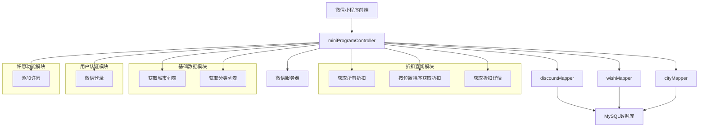
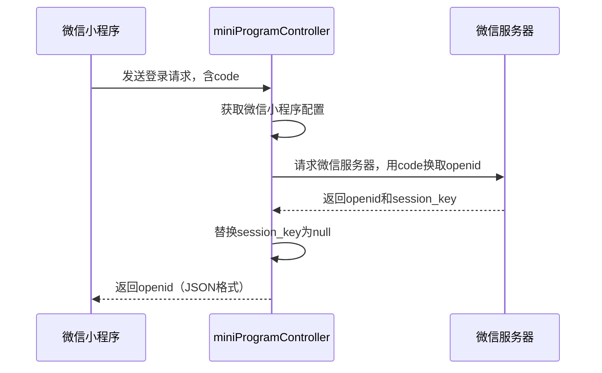
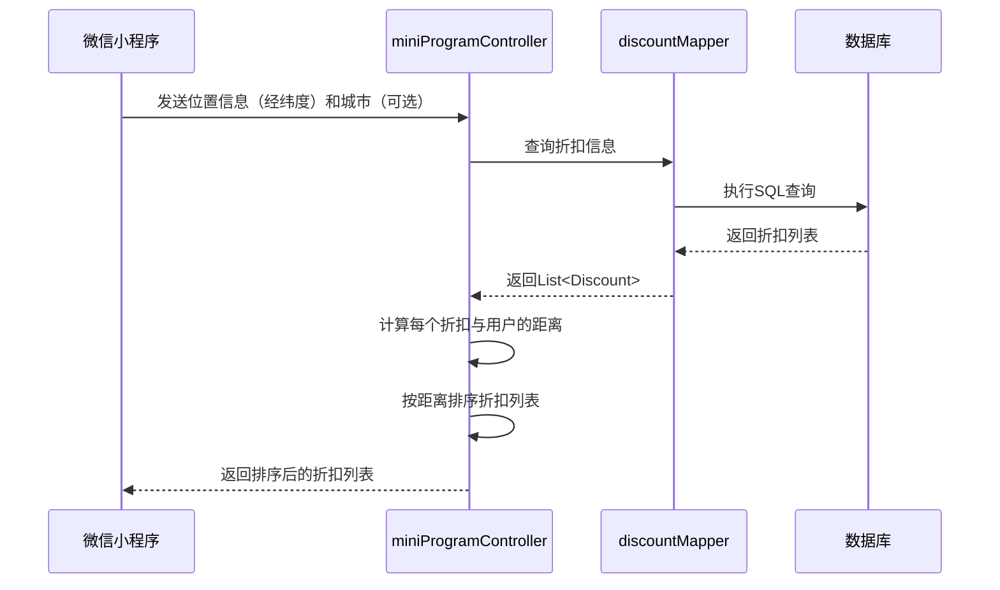
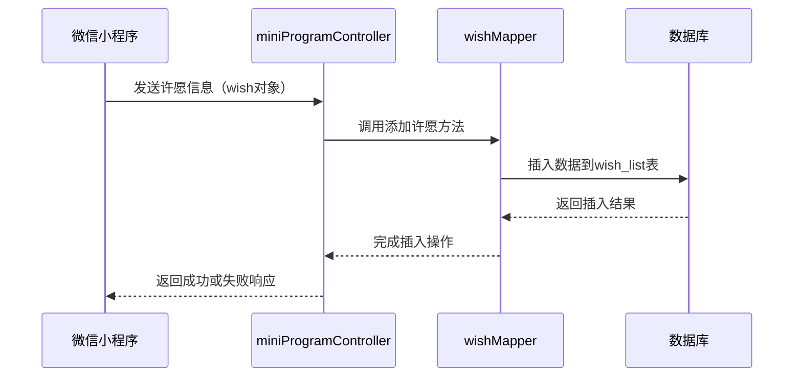

# 员工折扣系统小程序API详细实现分析

## 1. 项目概述

本分析文档重点关注 `vendor/staffdiscount/api` 中面向小程序端的API实现，这些API主要由 `miniProgramController` 类提供，路径为 `/discount`。小程序API主要服务于员工用户，提供折扣查询、城市和分类获取、微信登录以及许愿功能。

## 2. 小程序API架构



## 3. 核心API详细实现

### 3.1 获取所有折扣

#### 接口信息
- **路径**：`/discount/getAll`
- **方法**：GET
- **需登录**：否
- **返回类型**：`List<Discount>`

#### 实现代码分析

```java
@RequestMapping("/getAll")
public List<Discount> getAllDiscounts(){
    logger.info("[getAllDiscounts][list<discount>][path=/getAll]");
    List<Discount> discounts = discountMapper.getAll();
    return discounts;
}
```

#### 功能说明
- 该接口用于获取所有折扣信息列表，但不包含详细信息
- 直接调用 `discountMapper.getAll()` 方法查询数据库
- 使用 `@ResponseBody` 注解直接返回 JSON 格式数据

#### SQL查询（discountMapper.getAll）

```sql
SELECT id,city, name, discount, introduction, discount_detail, start_date, end_date, address, phone_number, longitude, latitude, pic_url, icon_url, barrier_free, status, creator, updater, update_time, create_time, category.category as 'category'
FROM discount join category where discount.category = category.category_id order by discount.id desc
```

---

### 3.2 按位置排序获取折扣

#### 接口信息
- **路径**：`/discount/getAllSortedByLocation`
- **方法**：GET
- **需登录**：否
- **参数**：
  - `city`（可选）：城市名称
  - `longitude`：经度
  - `latitude`：纬度
- **返回类型**：`List<Discount>`

#### 实现代码分析

```java
@RequestMapping("/getAllSortedByLocation")
public List<Discount> getDiscountsSortedByLocation(@RequestParam(value = "city", required = false) String city, double longitude, double latitude){
    logger.info("[getDiscountsSortedByLocation][list<discount>][path=/getAllSortedByLocation]");
    List<Discount> discounts = discountMapper.getAllDiscounts(city);
    List<Discount> output = new ArrayList<Discount>();
    for(int i=0;i < discounts.size();i++) {
        Discount d = discounts.get(i);
        double distances = GeoUtils.getDistance(d.getLongitude(),d.getLatitude(),longitude,latitude);
        d.distance = distances;
        output.add(d);
    }
    Collections.sort(output);
    return output;
}
```

#### 功能说明
- 根据用户位置按距离排序获取折扣信息
- 支持按城市筛选折扣
- 使用 `GeoUtils.getDistance()` 计算距离
- 使用 `Collections.sort()` 按距离排序（升序）

#### 关键技术点
1. **地理位置计算**：使用 `GeoUtils.getDistance()` 方法实现基于经纬度的距离计算
2. **动态筛选**：支持按城市参数筛选折扣
3. **排序**：实现了 `Discount` 类的 `Comparable` 接口，按距离升序排序
4. **性能优化**：在内存中计算和排序，避免了数据库操作的复杂性

#### SQL查询（discountMapper.getAllDiscounts）

```sql
<select id="getAllDiscounts" resultMap="discountResult">
    SELECT id,city, category.category as 'category',create_time, date(update_time) as 'update_time' , name,discount,start_date,end_date,longitude,latitude,icon_url, barrier_free ,status
    FROM discount join category where discount.category = category.category_id AND discount.status = 0
    <if test="city != null">AND city = #{city}</if>
</select>
```

---

### 3.3 获取城市列表

#### 接口信息
- **路径**：`/discount/getCity`
- **方法**：GET
- **需登录**：否
- **返回类型**：`List<City>`

#### 实现代码分析

```java
@RequestMapping("/getCity")
public List<City> getCity(){
    logger.info("[getCity][List<city>][path=/getCity]");
    return cityMapper.getCity();
}
```

#### 功能说明
- 获取所有支持的城市列表
- 直接调用 `cityMapper.getCity()` 方法查询数据库
- 返回格式为 `List<City>`，包含城市ID、名称和代码

#### SQL查询（cityMapper.getCity）

```sql
SELECT city_id, city, code FROM city
```

---

### 3.4 获取分类列表

#### 接口信息
- **路径**：`/discount/getCategory`
- **方法**：GET
- **需登录**：否
- **返回类型**：`List<Category>`

#### 实现代码分析

```java
@RequestMapping("/getCategory")
public List<Category> getCategory(){
    logger.info("[getCategory][List<category>][path=/getCategory]");
    return discountMapper.getCategory();
}
```

#### 功能说明
- 获取所有折扣分类列表
- 直接调用 `discountMapper.getCategory()` 方法查询数据库
- 返回格式为 `List<Category>`，包含分类ID和名称

#### SQL查询（discountMapper.getCategory）

```sql
SELECT category_id, category FROM category
```

---

### 3.5 获取折扣详情

#### 接口信息
- **路径**：`/discount/detail`
- **方法**：GET
- **需登录**：否
- **参数**：`id`（折扣ID）
- **返回类型**：`Discount`

#### 实现代码分析

```java
@RequestMapping("/detail")
public Discount getDetail(int id){
    logger.info("[getDetail][discount][path=/detail]");
    return discountMapper.getDetail(id);
}
```

#### 功能说明
- 根据折扣ID获取详细信息
- 直接调用 `discountMapper.getDetail(id)` 方法查询数据库
- 返回格式为 `Discount` 对象，包含折扣的所有属性

#### SQL查询（discountMapper.getDetail）

```sql
SELECT id, city, category.category as 'category', name, discount, introduction, discount_detail, start_date, end_date, address, phone_number, longitude, latitude, pic_url, icon_url, barrier_free, creator, updater, update_time, create_time, status
FROM discount join category WHERE discount.category = category.category_id AND discount.id =#{id}
```

---

### 3.6 微信登录

#### 接口信息
- **路径**：`/discount/login`
- **方法**：GET
- **需登录**：否
- **参数**：`code`（微信小程序登录凭证）
- **返回类型**：`String`（JSON格式）

#### 实现代码分析

```java
@RequestMapping("/login")
public String wechatUserLogin(String code) throws IOException {
    String appID = WebConfig.getWechatAppId();
    String appSecret = WebConfig.getWechatAppSecret();
    logger.info("[wechatUserLogin][String][path=/login][wechat]["+ (appID != null) +"]["+ (appSecret != null) +"]");
    String result = "";
    try{
        //请求微信服务器，用code换取openid。HttpUtil是工具类
        result = HttpUtil.doGet(
                "https://api.weixin.qq.com/sns/jscode2session?appid="
                        + appID + "&secret="
                        + appSecret + "&js_code="
                        + code
                        + "&grant_type=authorization_code", null);
        // 将结果转换为JSON对象
        JSONObject jsonResult = JSON.parseObject(result);
        // 更新jsonResult中的session_key
        jsonResult.put("session_key", "null");
        // 将jsonResult转换为字符串
        result = jsonResult.toJSONString();
    }
    catch (Exception e) {
        logger.info("[Wechat Login Exception]["+e.toString()+"]");
    }
    return result;
}
```

#### 功能说明
- 实现微信小程序登录功能
- 接受小程序传来的登录凭证 `code`
- 使用 `HttpUtil.doGet()` 请求微信服务器换取 `openid` 和 `session_key`
- 为了安全起见，将 `session_key` 替换为 `null` 后返回给前端

#### 关键技术点
1. **微信登录流程**：调用微信服务器API实现登录认证
2. **配置管理**：从 `WebConfig` 中获取微信小程序的 `appID` 和 `appSecret`
3. **HTTP请求**：使用 `HttpUtil.doGet()` 发送HTTP请求
4. **JSON处理**：使用FastJSON解析和构造JSON响应
5. **安全性**：将 `session_key` 替换为 `null`，防止前端获取敏感信息

#### 微信API请求

```http
GET https://api.weixin.qq.com/sns/jscode2session?appid=APPID&secret=SECRET&js_code=CODE&grant_type=authorization_code
```

---

### 3.7 添加许愿

#### 接口信息
- **路径**：`/discount/addWish`
- **方法**：POST
- **需登录**：否
- **参数**：`Wish` 对象（包含许愿内容、分类、城市、openid等）
- **返回类型**：`StaffResult`

#### 实现代码分析

```java
@RequestMapping(value = "/addWish", method = RequestMethod.POST)
public StaffResult addWish(Wish wish){
    logger.info("[addWish][String][path=/addWish]");
    try{
        wishMapper.addWish(wish);
    } catch (Exception e){
        logger.info("/addWish "+e.toString());
        return new StaffResult("1", "许愿失败");
    }
    return new StaffResult("0", "许愿成功");
}
```

#### 功能说明
- 接受用户的许愿信息并保存到数据库
- 调用 `wishMapper.addWish(wish)` 方法插入数据
- 使用 `StaffResult` 封装响应，包含状态码和信息

#### SQL操作（wishMapper.addWish）

```sql
INSERT INTO wish_list(wish_desc, wish_category, city, open_id, sametime_name, wish_otherinfo)
VALUES(#{wishDesc}, #{wishCategory}, #{city}, #{openId}, #{sametimeName}, #{wishOtherInfo})
```

---

## 4. 核心工具类与配置

### 4.1 GeoUtils（地理位置计算工具）

```java
package com.htcanglefund.staffdiscount.util;

public abstract class GeoUtils {

    public static double getDistance(double lat1, double lng1, double lat2,
        double lng2) {
        double radLat1 = lat1* Math.PI / 180.0;
        double radLat2 = lat2* Math.PI / 180.0;
        double a = radLat1 - radLat2;
        double b = lng1* Math.PI / 180.0 - lng2* Math.PI / 180.0;
        double s = 2 * Math.asin(Math.sqrt(Math.pow(Math.sin(a / 2), 2)
        + Math.cos(radLat1) * Math.cos(radLat2)
        * Math.pow(Math.sin(b / 2), 2)));
        s = s * 6378.137;
        s = Math.round(s * 10000d) / 10000d;
        return s;
    }
}
```

**功能**：计算两个经纬度之间的距离（单位：公里）
**算法**：使用球面距离公式（Haversine公式）计算地球表面两点之间的距离
**精度**：保留4位小数

---

### 4.2 WebConfig（微信小程序配置）

```java
package com.htcanglefund.staffdiscount.bean;

public class WebConfig {

    private static String wechatAppId;
    private static String wechatAppSecret;

    public static String getWechatAppId() {
        return wechatAppId;
    }

    public static void setWechatAppId(String wechatAppId) {
        WebConfig.wechatAppId = wechatAppId;
    }

    public static String getWechatAppSecret() {
        return wechatAppSecret;
    }

    public static void setWechatAppSecret(String wechatAppSecret) {
        WebConfig.wechatAppSecret = wechatAppSecret;
    }
}
```

**功能**：存储和获取微信小程序的配置信息
**配置项**：
- `wechatAppId`：微信小程序的AppID
- `wechatAppSecret`：微信小程序的AppSecret

---

### 4.3 Wish（许愿对象）

```java
package com.htcanglefund.staffdiscount.bean;

import java.io.Serializable;

public class Wish implements Serializable {

    private static final long serialVersionUID = 306234452090526122L;

    private int count;
    private String wishDesc;
    private String createTime;
    private String wishCategory;
    private String city;
    private String openId;
    private String sametimeName;
    private String wishOtherInfo;

    // 省略 getter 和 setter 方法
}
```

**功能**：封装用户的许愿信息
**属性说明**：
- `count`：许愿计数
- `wishDesc`：许愿描述
- `createTime`：创建时间
- `wishCategory`：许愿分类
- `city`：城市
- `openId`：微信用户的openid
- `sametimeName`：同时期名称
- `wishOtherInfo`：其他信息

---

## 5. 数据库表结构

### 5.1 wish_list（许愿表）

| 字段名 | 类型 | 说明 |
|-------|------|------|
| id | int | 主键，自增 |
| wish_desc | varchar | 许愿描述 |
| wish_category | varchar | 许愿分类 |
| city | varchar | 城市 |
| open_id | varchar | 微信用户的openid |
| sametime_name | varchar | 同时期名称 |
| wish_otherinfo | varchar | 其他信息 |
| create_time | datetime | 创建时间 |

---

### 5.2 其他相关表

- `discount`：折扣表（结构见折扣管理API分析文档）
- `city`：城市表（结构见用户管理API分析文档）
- `category`：分类表（结构见用户管理API分析文档）

---

## 6. 核心业务流程

### 6.1 微信登录流程



---

### 6.2 按位置排序获取折扣流程



---

### 6.3 添加许愿流程



---

## 7. 技术特点与优势

### 7.1 架构设计
- **简单直接**：小程序API设计简洁，直接对应业务需求
- **无状态**：API采用无状态设计，符合RESTful风格
- **高性能**：在内存中计算距离和排序，避免了数据库操作的复杂性

### 7.2 数据安全
- **敏感信息保护**：微信登录API返回结果中隐藏了session_key
- **参数验证**：对输入参数进行了基本验证（如required=false）

### 7.3 用户体验优化
- **位置排序**：按距离排序返回折扣，提升用户体验
- **搜索优化**：支持按城市筛选折扣
- **响应格式**：直接返回JSON格式数据，方便前端处理

### 7.4 代码质量
- **模块化设计**：控制器、数据访问层和工具类职责分离
- **日志记录**：每个API都有详细的日志记录
- **异常处理**：对可能的异常进行了捕获和处理

---

## 8. 潜在优化点

### 8.1 性能优化
- **缓存机制**：对城市和分类列表添加缓存，减少数据库查询
- **分页查询**：对大量折扣数据实现分页查询
- **索引优化**：在discount表的city、category和status字段上添加索引

### 8.2 功能优化
- **搜索功能**：添加按折扣名称和描述搜索的功能
- **筛选功能**：支持按折扣力度、有效期等条件筛选
- **用户反馈**：提供许愿成功后的反馈机制

### 8.3 安全性优化
- **接口签名**：对所有API请求添加签名验证
- **参数验证**：增强对输入参数的验证
- **访问限制**：对API请求频率进行限制

### 8.4 代码优化
- **响应封装**：统一API响应格式，包括状态码、消息和数据
- **异常处理**：统一异常处理机制
- **文档完善**：添加API文档，方便开发和维护

---

## 9. 总结

小程序API是员工折扣系统的重要组成部分，为微信小程序提供了完整的后端支持。API设计简洁高效，功能涵盖了折扣查询、城市分类获取、微信登录和许愿功能。

通过位置排序和城市筛选，提升了用户体验；通过微信登录实现了用户身份验证；通过许愿功能收集了用户需求。整体架构清晰，代码质量良好，符合现代Web应用开发规范。

虽然系统已经具备了基本功能，但在性能优化、安全性和功能扩展方面仍有改进空间。可以考虑添加缓存机制、搜索功能、接口签名验证等功能，进一步提升系统的性能和安全性。
