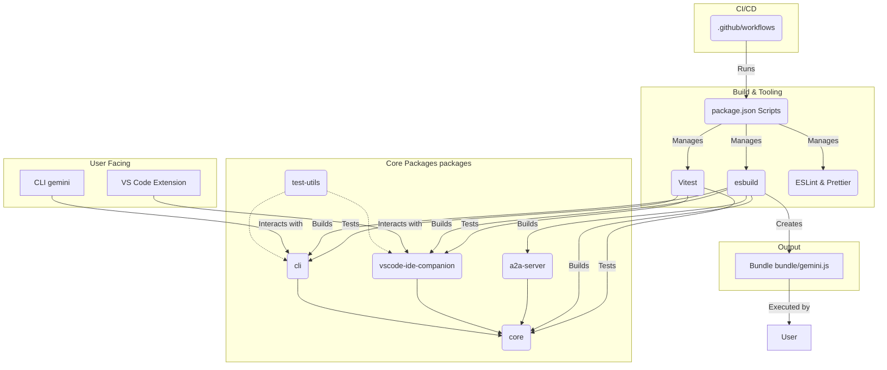
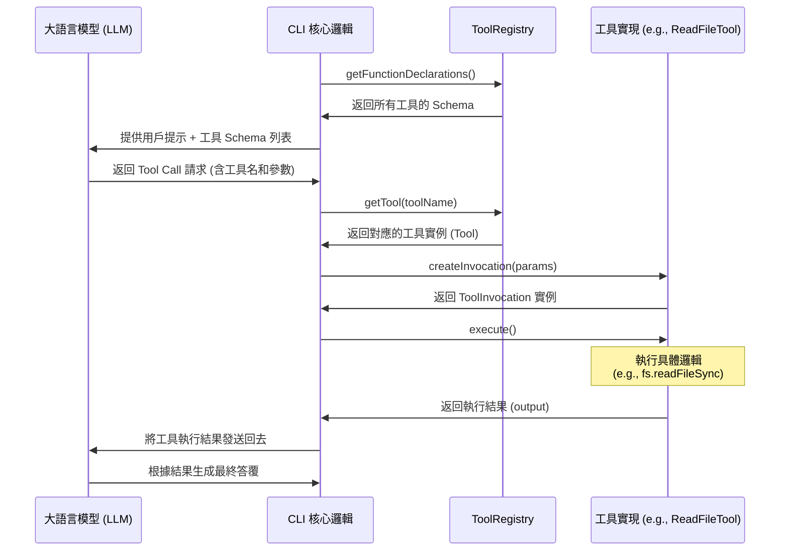

# Gemini CLI 項目文檔結構與功能分析

本文檔旨在深入分析 `vendor/gemini-cli` 項目，解析其目錄結構、核心功能、構建流程和技術棧，並通過 Mermaid 圖表提供一個可視化的架構總結。

## 1. 項目概述

Gemini CLI 是一個基於 Node.js 和 TypeScript 的命令行工具。它採用了現代化的 Monorepo 架構來管理代碼，利用 `esbuild` 進行快速構建，使用 `Vitest` 進行測試，並通過 `Ink` 和 `React` 提供豐富的命令行交互界面。其模塊化的設計使其具備良好的擴展性和可維護性。

## 2. 目錄結構分析

項目的文件夾結構清晰，職責分明。以下是其核心目錄的分析：

- **`/packages`**: Monorepo 的核心，存放著所有獨立的功能模塊。
    - `cli`: 命令行主程序，負責解析命令、處理用戶輸入和渲染 UI (基於 Ink)。
    - `core`: 存放項目的核心業務邏輯、API 封裝和共享工具函數，是其他模塊依賴的基礎。
    - `a2a-server`: Agent-to-Agent 服務器，可能用於不同代理或服務間的通信。
    - `vscode-ide-companion`: VS Code IDE 的伴隨擴展，提供與編輯器的深度集成。
    - `test-utils`: 存放測試用的共享輔助函數。
- **`/scripts`**: 存放項目自動化腳本，如構建、測試、清理、代碼生成等。這是項目開發工作流的核心驅動力。
- **`/integration-tests`**: 存放端到端的集成測試，用於驗證整個應用在真實環境下的行為。
- **`/docs`**: 存放項目文檔，包括架構說明、用戶指南、API 文檔等。
- **`/bundle`**: 腳本打包後的輸出目錄。`package.json` 中的 `"bin"` 字段指向此處的 `gemini.js`，作為 CLI 的執行入口。
- **`.github`**: 存放與 GitHub 相關的配置，如 CI/CD Workflows、Issue 模板、Dependabot 配置等，是項目持續集成和自動化管理的核心。
- **配置文件**:
    - `package.json`: 定義了項目依賴、工作區 (workspaces)、以及核心的 `scripts` 命令。
    - `esbuild.config.js`: `esbuild` 打包工具的配置文件。
    - `tsconfig.json`: TypeScript 編譯器的配置文件。
    - `eslint.config.js` & `.prettierrc.json`: 代碼質量和格式化工具的配置。

## 3. 功能與工作流分析

### 3.1 核心架構

項目採用了典型的 "核心庫 + 應用層" 的分離架構。`packages/core` 提供了所有底層能力，而 `packages/cli` 則作為一個面向用戶的交互層，消費 `core` 的功能。這種設計使得核心邏輯可以被輕易地複用（例如，被 `vscode-ide-companion` 或其他潛在的集成所使用）。

### 3.2 開發與構建流程

開發者通過 `package.json` 中的 `scripts` 與項目進行交互：
1.  **安裝**: `npm install` 會根據 `workspaces` 配置安裝所有 `packages` 的依賴。
2.  **開發**: `npm start` 會啟動開發模式。
3.  **構建**: `npm run build` 會調用 `scripts/build.js`，使用 `esbuild` 將 `packages` 中的源碼打包到 `bundle` 目錄。
4.  **測試**: `npm test` 運行所有單元測試，而 `npm run test:integration:all` 則執行更全面的集成測試。
5.  **代碼規範**: `npm run lint` 和 `npm run format` 確保所有代碼遵循統一的風格。
6.  **提交前檢查**: `npm run preflight` 是一個關鍵的質量門禁，它會在提交代碼前執行一系列完整的檢查（清理、構建、lint、測試等），確保代碼庫的健康。

## 4. 項目架構 Mermaid 圖

以下圖表直觀地展示了 Gemini CLI 的主要組件及其相互關係。

## 5. 總結

Gemini CLI 是一個結構精良、高度模塊化的現代 TypeScript 項目。它通過 Monorepo 管理複雜性，利用高效的工具鏈保證了開發效率和代碼質量。其清晰的分層架構（核心邏輯、應用層、擴展）不僅使其易於維護，也為未來的功能擴展和跨平台集成（如 VS Code）打下了堅實的基礎。對於希望學習如何構建複雜命令行工具的開發者來說，這是一個優秀的參考範例。

## 6. 工具系統分析 (Tool System Analysis)

Gemini CLI 的一個核心特性是其強大且可擴展的工具系統。該系統允許大語言模型（LLM）與本地文件系統、外部命令和服務進行交互。

### 6.1 工具的定義與註冊

所有工具的邏輯都位於 `packages/core/src/tools` 目錄中。
- **工具定義**: 每一個工具（如 `read-file`、`run_shell_command`）都被封裝在一個繼承自 `BaseDeclarativeTool` 的類中。這個類包含兩個核心部分：
    1.  **Schema (模式)**: 一個符合 `FunctionDeclaration` 格式的 JSON 對象，詳細描述了工具的名稱、功能和參數。這個 Schema 會被發送給 LLM，讓模型理解該如何使用這個工具。
    2.  **執行邏輯**: 一個 `execute` 方法，包含了工具被調用時要執行的具體 TypeScript/JavaScript 代碼。
- **工具註冊**: `ToolRegistry` 類是整個工具系統的中樞。它實例化後會持有一個所有工具的列表。
    - **內置工具**: 像 `read_file` 這樣的核心工具在代碼中被硬編碼並直接註冊到 `ToolRegistry` 中。
    - **動態發現工具**: `ToolRegistry` 的 `discoverAllTools` 方法提供了一個強大的擴展點。它會執行一個用戶可配置的外部發現命令（`tool_discovery_command`）。該命令會掃描當前項目，並返回一個 JSON 格式的工具列表。`ToolRegistry` 隨後會自動將這些 "發現" 的工具註冊進來。這使得任何項目都可以通過一個簡單的腳本暴露自己的特定工具給 Gemini CLI，而無需修改 CLI 的源代碼。

### 6.2 工具的調用流程

工具的調用是一個清晰的多步流程，涉及模型、CLI核心邏輯和工具本身。

1.  **聲明**: CLI 將 `ToolRegistry` 中所有 *活動* 工具的 Schema 列表發送給 LLM。
2.  **決策**: LLM 根據用戶的提示和上下文，決定調用一個或多個工具。它會生成一個包含工具名稱和參數的 `tool_code` 響應。
3.  **解析與查找**: Gemini CLI 的核心邏輯解析這個 `tool_code`，從 `ToolRegistry` 中根據工具名稱查找到對應的工具實例。
4.  **創建調用實例**: 調用該工具實例的 `createInvocation` 方法，傳入從模型獲取的參數，創建一個 `ToolInvocation` 對象。
5.  **執行**: 執行 `ToolInvocation` 對象的 `execute` 方法。此時，工具的實際邏輯（如讀取文件、執行 shell 命令）開始運行。
6.  **返回結果**: `execute` 方法執行完畢後，將結果返回給 CLI 核心。
7.  **結果上報**: CLI 將工具執行的結果再次發送給 LLM，讓模型能夠根據工具的輸出繼續下一步的推理或生成最終答覆。

### 6.3 工具調用流程 Mermaid 圖

