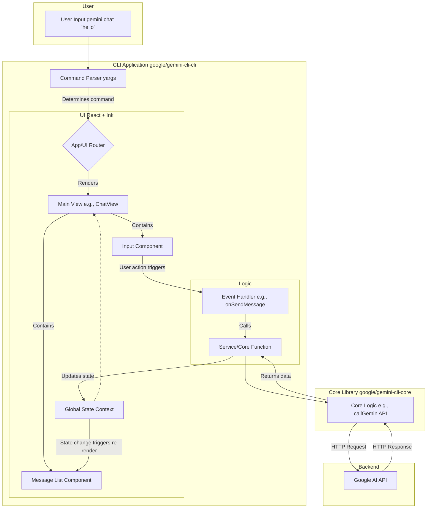

# Gemini CLI - CLI 主程序架構分析

本文檔基於對 `gemini-cli` 項目 `packages/cli` 模塊的深入分析，旨在闡述其主程序的內部架構、功能組織、交互模式和數據流。

## 1. CLI 主程序概述

`@google/gemini-cli-cli` 包是 Gemini CLI 的核心交互層。它本身是一個功能完備的、基於 React 和 Ink 的終端應用程序。其主要職責是：
- 解析用戶輸入的命令和參數。
- 管理應用程序的狀態（如用戶認證、會話歷史等）。
- 調用 `@google/gemini-cli-core` 包提供的核心功能。
- 將結果和交互界面渲染到終端。
- 區分處理交互式 (Interactive) 和非交互式 (Non-interactive) 兩種執行模式。

## 2. `cli/src` 目錄結構分析

`src` 目錄下的文件夾劃分清晰地反映了其架構模式，類似於一個典型的前端 React 項目。

- **`/commands`**: 包含所有子命令的具體實現邏輯和對應的 UI 入口。例如 `extensions.tsx` 可能就是 `gemini extensions` 命令的起點。
- **`/ui`**: 存放所有 UI 相關的代碼，是整個 CLI 的 "前端"。
    - `components`: 可複用的基礎 UI 組件（如輸入框、選項卡、加載動畫等）。
    - `layouts`: 頁面級別的佈局組件。
    - `contexts`: React Context，用於全局或局部範圍的狀態管理和依賴注入。
    - `hooks`: 自定義的 React Hooks，用於封裝組件邏輯和狀態管理。
    - `App.tsx`: 整個 React 應用的根組件。
- **`/core`**: CLI 應用本身的核心邏輯，例如命令路由、插件系統等。
- **`/services`**: 用於封裝與外部 API 或後端服務的通信。
- **`/config`**: 處理用戶配置的加載、解析和修改。
- **`gemini.tsx`**: 交互式模式的主入口，負責渲染 `App.tsx`。
- **`nonInteractiveCli.ts`**: 非交互式模式的主入口，用於在腳本或 CI 環境中直接執行命令並輸出結果，不渲染複雜的交互 UI。

## 3. 架構與數據流分析

Gemini CLI 的交互模式可以被視為一個 "終端中的單頁應用 (SPA in Terminal)"。

### 3.1 數據流 (交互式模式)

1.  **啟動**: 用戶在終端運行 `gemini`。
2.  **命令解析**: `Yargs` 或類似的庫解析命令行參數，確定要執行的主命令。
3.  **React 渲染**: 應用程序啟動 React 渲染器 (Ink)，掛載主組件 `App.tsx`。
4.  **路由與狀態管理**:
    - `App.tsx` 內部可能有一個類似 "路由" 的機制，根據解析出的命令，決定渲染哪個主視圖（如 `ChatView`, `ExtensionsView` 等）。
    - 全局狀態（如用戶信息、配置）通過 React Context (`ui/contexts`) 提供給所有子組件。
5.  **執行命令**:
    - 當用戶在 UI 中執行一個動作時（例如發送一條消息），對應的事件處理器會被觸發。
    - 該處理器通常會調用一個封裝在 `services` 或直接來自 `@google/gemini-cli-core` 的函數來執行核心邏輯。
6.  **異步操作與狀態更新**:
    - 核心庫函數執行異步操作（如調用 Google AI API）。
    - 在此期間，UI 通過 `useState` 或 `useReducer` 顯示加載狀態（如 `Spinner` 組件）。
    - 操作完成後，返回的數據通過狀態更新函數（如 `setMessages`）更新組件的 state。
7.  **重新渲染**: React 檢測到 state 變化，自動重新渲染受影響的 UI 組件，將新結果展示在終端上。

### 3.2 組件關係 Mermaid 圖

## 4. 總結

`@google/gemini-cli-cli` 不僅僅是一個簡單的命令行解析器，它是一個採用了現代前端開發模式構建的複雜終端應用程序。具體來說：
- **React**: 作為構建用戶界面的聲明式 JavaScript 庫，它允許開發者將複雜的 UI 拆分為獨立、可複用的組件。在 Ink 環境中，React 提供了一種高效且可預測的方式來管理終端界面的渲染和更新。
- **Hooks**: 這是 React 16.8 引入的特性，它讓函數組件能夠使用狀態 (state) 和其他 React 特性，而無需編寫 class。`useState` 用於組件內部狀態管理，`useEffect` 用於處理副作用（如數據獲取、訂閱），而 `useContext` 則用於訪問上下文。Hooks 使得代碼更簡潔、邏輯更清晰、更易於測試和複用。
- **Context**: React Context 提供了一種在組件樹中共享數據的方式，而無需通過 props 手動一層一層地傳遞。它非常適合傳遞那些對於許多組件來說都“全局”的數據，例如應用主題、用戶認證信息或配置設置。在 CLI 應用中，Context 可以有效地管理全局配置、用戶會話或命令上下文等。

這種架構帶來了諸多好處：

- **豐富的交互體驗**: 能夠實現遠超傳統 CLI 的複雜動態界面。
- **組件化和複用**: UI 和邏輯被拆分成高度可複用的組件和 Hooks。
- **強大的狀態管理**: React 的聲明式特性和 Context 機制使得管理複雜的應用狀態變得更加容易和可預測。
- **職責分離**: UI (`ui`)、命令邏輯 (`commands`)、核心功能 (`@google/gemini-cli-core`) 和服務交互 (`services`) 之間界限清晰，提高了代碼的可維護性和可測試性。
- **雙模式支持**: 通過 `gemini.tsx` 和 `nonInteractiveCli.ts` 兩個入口，巧妙地同時支持了面向人類用戶的豐富交互和面向自動化腳本的簡潔輸出。
