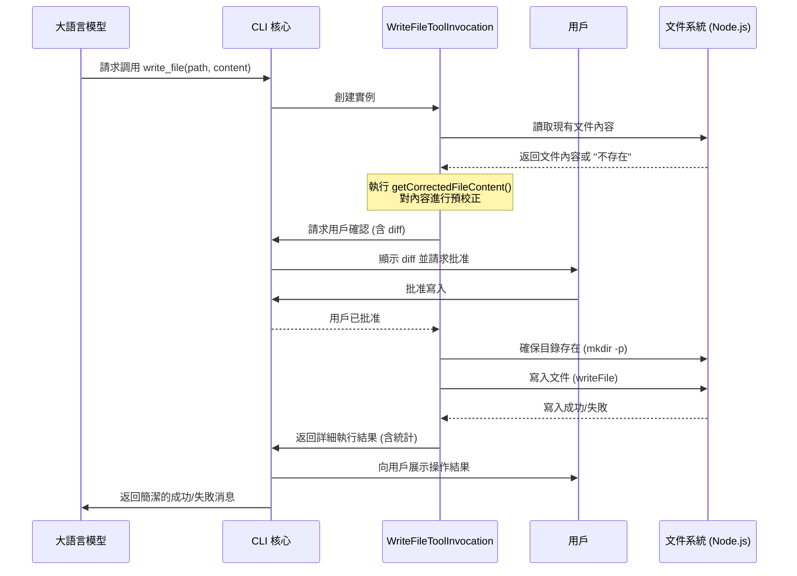

# Gemini CLI - `write_file` 工具深度分析

本文檔旨在深入剖析 Gemini CLI 項目中的核心文件系統工具——`write_file`，詳細闡述其定義、執行流程、安全機制和內部實現。

## 1. 工具概述

`write_file` 是 Gemini CLI 中負責與本地文件系統交互的關鍵工具之一。它允許大語言模型（LLM）創建新文件或覆蓋現有文件的內容。由於其操作具有潛在的破壞性，該工具的設計中包含了多層次的安全與智能輔助機制，以確保操作的準確性和用戶的可控性。

## 2. 工具定義 (Schema)

`write_file` 工具向 LLM 聲明了其功能和所需的參數。

- **名稱**: `write_file`
- **描述**: "向本地文件系統中的指定文件寫入內容。用戶有能力修改 `content`。如果被修改，將在響應中說明。"
- **參數**:
    - `file_path` (string, required): 要寫入的文件的路徑。
    - `content` (string, required): 要寫入文件的具體內容。

## 3. 調用與執行流程

`write_file` 的執行流程並非簡單的 "接收 -> 寫入"，而是一個涉及 **確認、校正、執行、反饋** 的完整閉環。

### 3.1 核心流程步驟

1.  **模型決策**: LLM 根據上下文決定調用 `write_file`，並生成包含 `file_path` 和 `content` 的工具調用請求。
2.  **調用實例化**: CLI 核心根據請求創建一個 `WriteFileToolInvocation` 實例。
3.  **內容校正 (Pre-computation)**: 在觸發確認或執行前，`getCorrectedFileContent` 函數會被調用。它會嘗試讀取文件的現有內容，並可能利用 LLM 對模型建議的 `content` 進行一次預校正，以確保代碼質量和上下文的連貫性。
4.  **用戶確認 (Safety Gate)**:
    - 這是最關鍵的一步。`getConfirmationDetails` 方法會被調用。
    - 該方法會生成一個清晰的 `diff` 視圖，向用戶展示文件的當前內容與即將寫入的內容之間的差異。
    - 一個確認請求會通過 `MessageBus` 發送到 UI 層，等待用戶交互（批准/拒絕）。
    - 只有在用戶批准後，流程才會繼續。這個機制極大地降低了意外覆蓋重要文件的風險。
5.  **執行写入**:
    - `execute` 方法被調用。
    - 它首先會確保目標文件的父目錄存在（`mkdir -p` 效果）。
    - 然後，它使用文件系統服務將（可能已被校正或用戶修改過的）內容寫入文件。
    - 內部包含詳盡的錯誤處理，能應對權限、磁盤空間等各種異常情況。
6.  **結果反饋**:
    - **給 UI**: 操作完成後，會生成一份包含 `diff` 統計信息的回饋，UI 層可以此向用戶展示詳細的操作結果。
    - **給 LLM**: 向 LLM 返回一條簡潔的成功或失敗信息（`llmContent`），以便模型進行後續的推理。

### 3.2 執行流程 Mermaid 圖

## 4. 總結

`write_file` 工具的設計體現了 Gemini CLI 在功能強大性與操作安全性之間的精妙平衡。它不僅僅是一個簡單的文件寫入器，更是一個集成了 **用戶確認、智能校正、和穩健錯誤處理** 的完整解決方案。通過 `diff` 視圖和強制確認流程，它賦予了用戶對文件系統修改的絕對控制權，而其內部的智能校正機制則進一步提升了模型生成代碼的質量和可用性，是現代 AI 輔助開發工具的典範設計。
