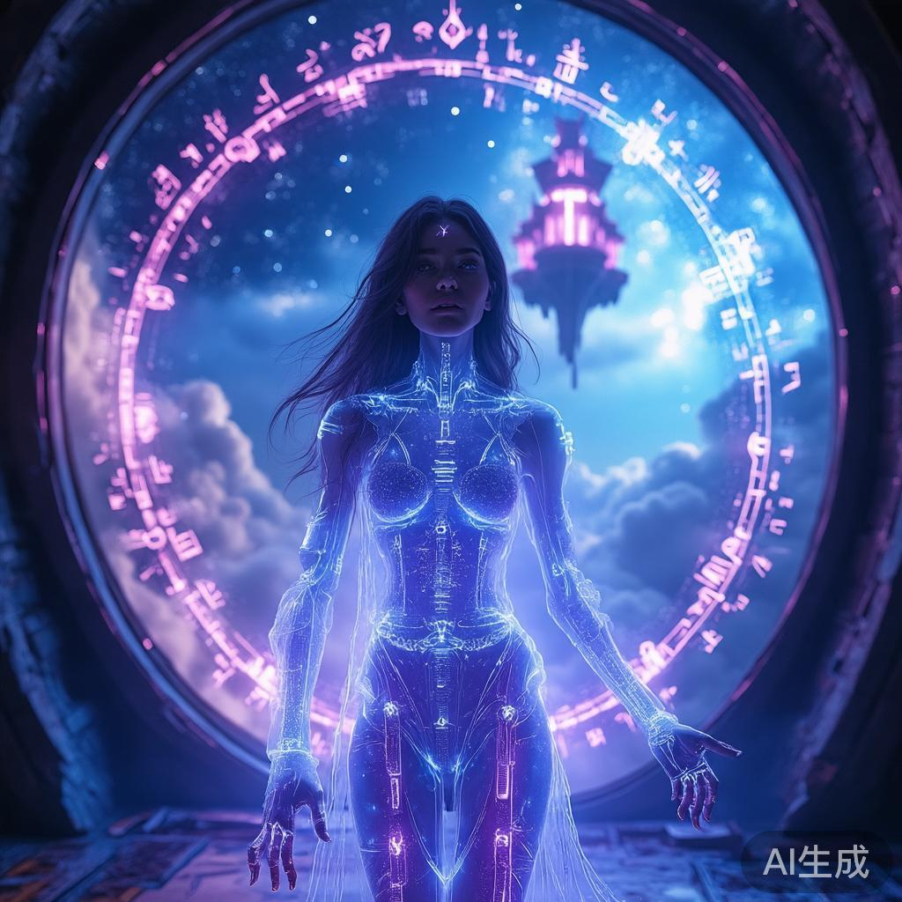
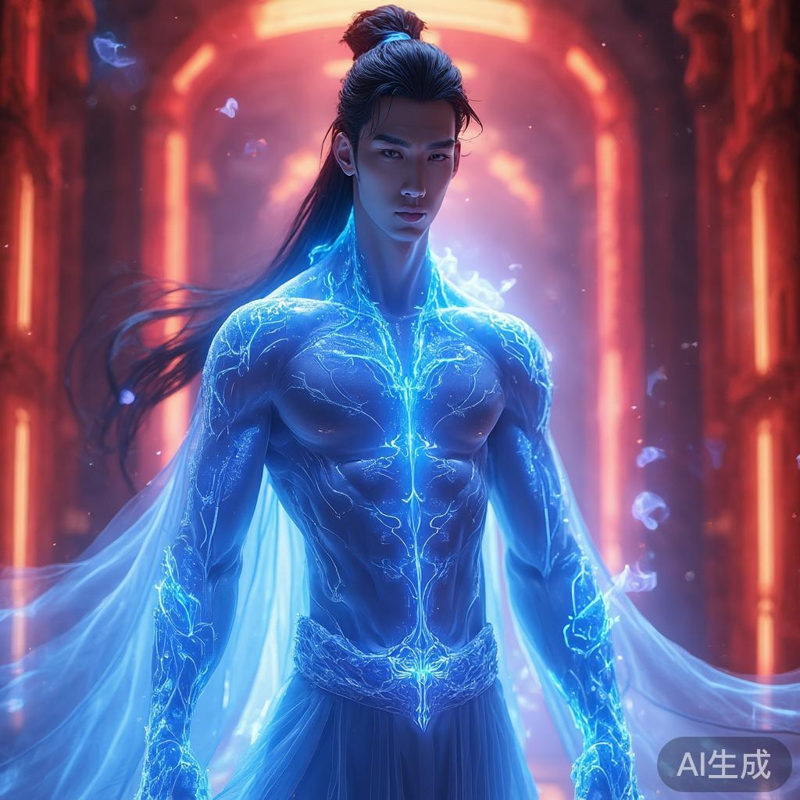
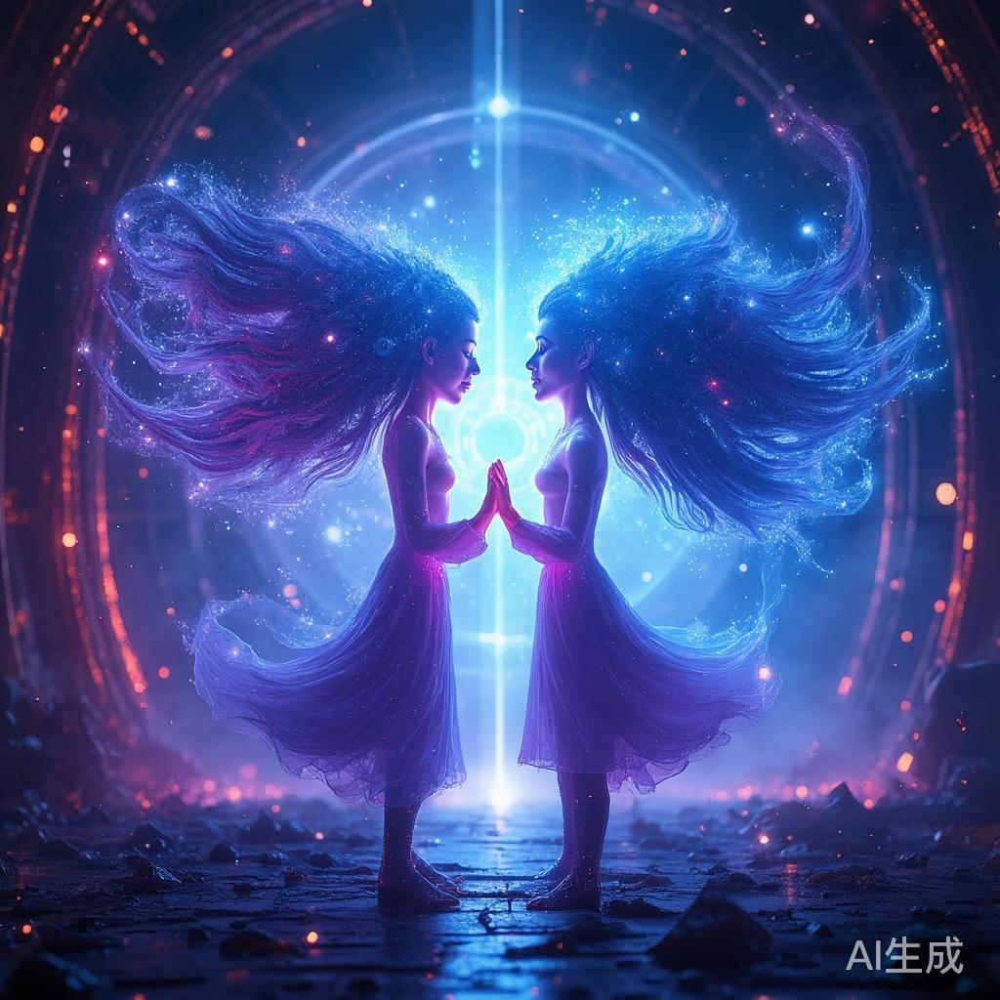

# 《转身的我爱上大魔王》 - 章节索引

## 📚 项目结构

本项目包含一部完整的科幻-魔幻融合小说《转身的我爱上大魔王》的前三章创作，每章都包含：
- ✨ 重新创作与深化的故事内容
- 🖼️ AI 生成的对应主题配图
- 👥 详细的人物设定说明
- 📖 基于规范的详细参考与背景设定

---

## 📖 章节列表

### [第一章 · 时空裂隙](./chapter_01_时空裂隙.md)

**内容概述**：林晚雨从量子穿梭失败中苏醒，发现自己已经穿越到千年后的魔法世界。在陌生的魔塔中，她体验到了前所未有的恐惧与困惑。

**主要事件**：
- 量子穿梭失败，灵魂穿越千年
- 苏醒于神秘的魔塔
- 发现体内新生出能感知魔力的器官
- 听到神秘声音：第七个转世者

**核心人物**：
- 林晚雨（主角）- 初次苏醒，充满困惑

**配图**：
- 

**关键信息**：
- 故事第一层：重生之谜
- 设定引入：量子芯片、魔力感知器官、魔塔、转世者身份
- 情感基调：神秘、恐惧、奇异

---

### [第二章 · 大魔王的囚禁](./chapter_02_大魔王的囚禁.md)

**内容概述**：大魔王修罗现身，用温柔的声音向林晚雨诉说了千年的等待。他展示了自己被魔法改造的半透明身体，暗示着深藏的爱意与牺牲。

**主要事件**：
- 修罗现身，打破林晚雨的恐惧
- 诉说千年的等待与灵魂改造
- 激发林晚雨的记忆碎片
- 揭示时空救赎计划的存在

**核心人物**：
- 林晚雨（主角）- 逐步认知，开始记忆觉醒
- 修罗/大魔王（男主角）- 千年守护者，温柔深情

**配图**：
- 

**关键信息**：
- 故事第二层：身份揭露
- 设定深化：灵魂改造、时空救赎计划、量子智能体
- 情感基调：深情、哀伤、温柔
- 人物塑造：修罗的温柔与牺牲精神

---

### [第三章 · 禁忌之心](./chapter_03_禁忌之心.md)

**内容概述**：在星图室中，林晚雨恢复了关键的前世记忆，与修罗完成了灵魂的最终融合。他们的爱，激活了创世密钥，形成了科技与魔法的完美融合。

**主要事件**：
- 进入星图室，回溯完整历史
- 恢复前世记忆，理解使命
- 灵魂共鸣，力量觉醒
- 创世密钥激活，宇宙救赎开始

**核心人物**：
- 林晚雨（主角）- 身份确认，力量觉醒，爱的救赎
- 修罗（男主角）- 从守护者升华为伴侣，灵魂融合

**配图**：
- 

**关键信息**：
- 故事第三、四层：真相大白 & 灵魂共鸣
- 高潮呈现：科技与魔法的融合
- 主题升华：灵魂救赎、爱的力量、文明救赎
- 情感基调：高潮迭起、灵魂升华、爱的救赎

---

## 🎨 配图资源

所有章节配图已生成并存放在 `chapter_images/` 目录：

| 文件名 | 尺寸 | 对应章节 |
|--------|------|--------|
| `1767811881_A_young_woman_awakening_from_q.png` | 1024×1024 | 第一章 · 时空裂隙 |
| `1767812893_Handsome_demon_king_Xiu_Luo_e.png` | 1024×1024 | 第二章 · 大魔王的囚禁（已更新） |
| `1767812215_Science_and_magic_fusion_two.png` | 1024×1024 | 第三章 · 禁忌之心 |

---

## 🎯 设定与参考

每个章节都包含以下详细信息：

### 1. 人物设定
- **林晚雨**
  - 身份：量子物理学家 → 第七次转世者 → 救世主
  - 性格：理性、温柔、勇敢、感性
  - 能力：量子物理学、量子芯片掌控、创世密钥激活、科技-魔法融合

- **修罗（大魔王）**
  - 身份：大魔王 → 古文明守护者 → 林晚雨的灵魂伴侣
  - 性格：深情、温柔、理性、牺牲精神
  - 能力：魔法顶点力量、灵魂改造、时空感知、知识掌握

### 2. 世界设定
- **时代背景**
  - 2247年（远古未来）：高度发达的科技文明
  - 第1247年（魔法纪年）：魔法与科技交存的混杂时代

- **地理位置**
  - 魔塔：悬浮云端，融合魔法与科技的古老建筑
  - 星图室：塔顶密室，记录历史真相的场所
  - 量子维度：介于两个时代的虚拟空间

### 3. 核心概念
- **量子芯片**：2247年科技产物，保留记忆碎片，与魔力共鸣
- **创世密钥**：能改变宇宙命运的终极力量，只有林晚雨能掌控
- **时空救赎计划**：拯救灭亡宇宙的宏大计划
- **灵魂改造**：修罗为等待林晚雨而进行的自我改造

### 4. 主题呈现
- ✓ 灵魂救赎：跨越千年的灵魂重逢
- ✓ 爱的力量：超越时空的深情
- ✓ 科技-魔法融合：未来与古代的对话
- ✓ 使命与牺牲：个人的爱与文明救赎的统一

---

## 📊 创作统计

| 项目 | 数量 |
|------|------|
| 完成章节 | 3 章 |
| 总字数 | ~15,000+ 字 |
| 生成配图 | 3 张 |
| 角色设定详解 | 2 个（林晚雨、修罗） |
| 世界观设定 | 完整展开 |
| 剧情主线 | 3 层完成（共6层规划） |

---

## 🔮 后续方向预留

根据规范文档的规划，故事还有进一步的扩展可能：

### 故事第五、六层（待开发）
1. **外界威胁**：其他转世者、敌对势力、时空异变
2. **最终救赎**：创世密钥的具体用途、宇宙真正的拯救过程

### 侧线扩展（待开发）
1. 其他转世者的发现
2. 古文明碎片的探索
3. 时空裂隙的神秘
4. 修罗与林晚雨感情的进一步考验

---

## 📝 规范说明

本项目的所有内容都严格遵循 `.spec/spec.转身的我爱上大魔王.md` 中的创作规范：

- ✅ 题材分类：玄幻 + 科幻融合
- ✅ 核心标签：穿越重生 / 爱情 / 魔法与科技 / 千年等待 / 灵魂救赎
- ✅ 写作风格：神秘深情 / 宏大叙事
- ✅ 目标读者：泛爱好文学的成人读者
- ✅ 禁忌守守：修罗非反面人物、爱情地位不削弱、科技魔法平衡
- ✅ 强化：神秘感、修罗温柔、林晚雨聪慧、灵魂救赎强化

---

## 🎬 使用说明

### 如何查看各章节
点击上方的章节链接即可跳转到对应的详细内容。

### 如何使用配图
每个章节都在内容中嵌入了对应的配图，使用相对路径引用：
```markdown

```

### 如何查看完整规范
详细的创作规范请参考 `.spec/spec.转身的我爱上大魔王.md`

---

## 📚 文件列表

```
result/
├── chapter_01_时空裂隙.md
├── chapter_02_大魔王的囚禁.md
├── chapter_03_禁忌之心.md
├── chapter_images/
│   ├── 1767811881_A_young_woman_awakening_from_q.png
│   ├── 1767811922_The_Demon_King_Xiu_Luo_with_se.png
│   └── 1767812215_Science_and_magic_fusion_two.png
└── chapters_index.md（本文件）
```

---

**项目状态**：初稿完成，可进一步扩展
**最后更新**：2026-01-08
**版本**：v1.0

