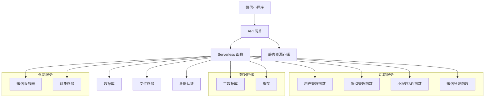

# 员工折扣系统 Serverless 架构技术栈方案

## 概述

本方案将原有的 Spring Boot 单体应用重构为基于 TypeScript 的 Serverless 架构，旨在提高应用的可扩展性、降低运维成本、优化资源利用率，并提供更快的部署和迭代速度。

## 架构设计

### 整体架构



## 技术栈选择

### 后端开发

#### 1. 语言与框架
- **主要语言**：TypeScript（替代 Java）
  - 类型安全，减少运行时错误
  - 与 JavaScript 生态系统高度兼容
  - 更好的开发体验和代码可维护性

- **Web 框架**：NestJS（替代 Spring Boot）
  - 模块化架构，与 Spring Boot 类似的架构理念
  - 内置依赖注入、中间件、异常处理等功能
  - 支持 GraphQL 和 RESTful API
  - 社区活跃，文档完善

#### 2. 数据库
- **主数据库**：MySQL（保持不变）
  - 成熟稳定，社区支持强大
  - 与原系统保持兼容，减少数据迁移成本

- **ORM**：TypeORM（替代 MyBatis）
  - 支持多种数据库，包括 MySQL
  - 类型安全的查询构建
  - 自动化数据库迁移
  - 与 NestJS 无缝集成

#### 3. 缓存
- **Redis**（新增）
  - 提高应用性能，减少数据库压力
  - 存储热门数据、会话信息等
  - 支持分布式缓存

#### 4. 文件存储
- **阿里云 OSS**（保持不变）
  - 成熟稳定的对象存储服务
  - 支持高并发访问
  - 提供 CDN 加速

### Serverless 架构

#### 1. 函数计算服务
- **阿里云函数计算**（FC）或 **AWS Lambda**（推荐）
  - 按需付费，降低成本
  - 自动扩缩容，应对高并发
  - 无需管理服务器和运维

#### 2. API 网关
- **阿里云 API 网关** 或 **AWS API Gateway**（推荐）
  - 统一入口管理
  - 请求路由、限流、监控
  - 支持 API 版本管理
  - 提供安全防护

#### 3. 身份认证
- **JWT**（保持不变）
  - 轻量级，无状态
  - 与 Serverless 架构契合
  - 使用 Auth0 或 Firebase Auth 增强安全性（可选）

#### 4. 部署与运维
- **Serverless Framework**
  - 统一的 Serverless 应用开发和部署工具
  - 支持多云平台
  - 提供本地开发、调试和部署功能

- **CI/CD**：GitHub Actions 或 GitLab CI
  - 自动化构建和部署
  - 测试自动化
  - 持续集成和持续部署

### 前端（小程序端）

#### 1. 开发语言
- **TypeScript**（替代 JavaScript）
  - 类型安全，提高代码质量
  - 更好的开发体验和代码可维护性

#### 2. 框架
- **Taro**（推荐）或 **uni-app**
  - 支持多端开发，包括微信小程序
  - 提供开发效率和代码复用
  - 与 React/Vue 类似的语法，学习成本低

#### 3. 状态管理
- **Redux** 或 **MobX**（推荐）
  - 管理应用状态
  - 提高组件间通信效率

#### 4. 网络请求
- **Axios** 或 **Taro.request**
  - 发送 HTTP 请求到后端 API

## 技术转变方案

### 1. 架构重构

#### 微服务化
将原有的单体应用拆分为多个 Serverless 函数：
- 用户管理函数
- 折扣管理函数
- 小程序API函数
- 微信登录函数

#### 数据库设计调整
- 保持原数据库表结构基本不变
- 优化索引，提高查询性能
- 添加缓存层，减少数据库压力

#### 数据迁移
- 使用 TypeORM 的迁移工具
- 分阶段迁移，确保数据安全

### 2. 代码重构

#### 目录结构设计

```
staff-discount-serverless/
├── src/
│   ├── modules/
│   │   ├── user/
│   │   │   ├── controller/
│   │   │   ├── service/
│   │   │   ├── entity/
│   │   │   └── dto/
│   │   ├── discount/
│   │   │   ├── controller/
│   │   │   ├── service/
│   │   │   ├── entity/
│   │   │   └── dto/
│   │   ├── wish/
│   │   │   ├── controller/
│   │   │   ├── service/
│   │   │   ├── entity/
│   │   │   └── dto/
│   │   └── common/
│   │       ├── filter/
│   │       ├── interceptor/
│   │       ├── exception/
│   │       └── decorator/
│   ├── config/
│   │   ├── database.ts
│   │   ├── cache.ts
│   │   └── oss.ts
│   ├── main.ts
│   └── app.module.ts
├── dist/
├── node_modules/
├── package.json
├── tsconfig.json
└── serverless.yml
```

#### 关键功能实现

##### 用户管理

```typescript
// src/modules/user/entity/user.entity.ts
import { Entity, Column, PrimaryGeneratedColumn } from 'typeorm';

@Entity('user')
export class User {
  @PrimaryGeneratedColumn()
  userId: number;

  @Column({ unique: true })
  username: string;

  @Column()
  password: string;

  @Column()
  city: string;

  @Column()
  companyGroup: string;

  @Column()
  role: string;

  @Column({ type: 'datetime' })
  createTime: Date;

  @Column({ type: 'datetime' })
  updateTime: Date;

  @Column({ type: 'bigint', nullable: true })
  expireDate: number;
}
```

```typescript
// src/modules/user/controller/user.controller.ts
import { Controller, Get, Post, Body, Param, Delete } from '@nestjs/common';
import { UserService } from '../service/user.service';
import { CreateUserDto } from '../dto/create-user.dto';
import { UpdateUserDto } from '../dto/update-user.dto';

@Controller('user')
export class UserController {
  constructor(private readonly userService: UserService) {}

  @Post()
  create(@Body() createUserDto: CreateUserDto) {
    return this.userService.create(createUserDto);
  }

  @Get()
  findAll() {
    return this.userService.findAll();
  }

  @Get(':id')
  findOne(@Param('id') id: string) {
    return this.userService.findOne(+id);
  }

  @Put(':id')
  update(@Param('id') id: string, @Body() updateUserDto: UpdateUserDto) {
    return this.userService.update(+id, updateUserDto);
  }

  @Delete(':id')
  remove(@Param('id') id: string) {
    return this.userService.remove(+id);
  }
}
```

##### 微信登录

```typescript
// src/modules/user/service/user.service.ts
import { Injectable } from '@nestjs/common';
import { InjectRepository } from '@nestjs/typeorm';
import { Repository } from 'typeorm';
import { User } from '../entity/user.entity';
import { CreateUserDto } from '../dto/create-user.dto';
import { UpdateUserDto } from '../dto/update-user.dto';
import * as axios from 'axios';
import { JwtService } from '@nestjs/jwt';

@Injectable()
export class UserService {
  constructor(
    @InjectRepository(User)
    private readonly userRepository: Repository<User>,
    private readonly jwtService: JwtService,
  ) {}

  async wechatLogin(code: string): Promise<any> {
    const appID = process.env.WECHAT_APP_ID;
    const appSecret = process.env.WECHAT_APP_SECRET;
    const url = `https://api.weixin.qq.com/sns/jscode2session?appid=${appID}&secret=${appSecret}&js_code=${code}&grant_type=authorization_code`;

    try {
      const response = await axios.default.get(url);
      const { openid, session_key } = response.data;

      // 生成JWT token
      const token = this.jwtService.sign({ openid });

      // 检查用户是否存在，不存在则创建新用户
      let user = await this.userRepository.findOne({ where: { openId: openid } });
      if (!user) {
        user = this.userRepository.create({ openId: openid });
        await this.userRepository.save(user);
      }

      return {
        token,
        openid,
        session_key: 'null', // 隐藏敏感信息
      };
    } catch (error) {
      throw new Error('微信登录失败');
    }
  }

  // 其他用户管理方法...
}
```

### 3. 部署方案

#### 开发环境部署

```bash
# 安装依赖
npm install

# 本地开发
npm run start:dev

# 生产环境构建
npm run build

# 部署到 Serverless 平台
npm run deploy
```

#### 生产环境部署

使用 Serverless Framework 配置：

```yaml
# serverless.yml
service: staff-discount-api

provider:
  name: aliyun
  region: cn-hangzhou
  runtime: nodejs14.x
  environment:
    WECHAT_APP_ID: ${env:WECHAT_APP_ID}
    WECHAT_APP_SECRET: ${env:WECHAT_APP_SECRET}
    DB_HOST: ${env:DB_HOST}
    DB_PORT: ${env:DB_PORT}
    DB_USERNAME: ${env:DB_USERNAME}
    DB_PASSWORD: ${env:DB_PASSWORD}
    DB_DATABASE: ${env:DB_DATABASE}

plugins:
  - '@serverless/aliyun-fc'

functions:
  api:
    handler: index.handler
    events:
      - http: ANY /
      - http: 'ANY {proxy+}'

resources:
  Resources:
    MyVpc:
      Type: ALIYUN::ECS::VPC
      Properties:
        VpcName: my-vpc
        CidrBlock: 192.168.0.0/16

    MyVSwitch:
      Type: ALIYUN::ECS::VSwitch
      Properties:
        VpcId:
          Ref: MyVpc
        ZoneId: cn-hangzhou-b
        CidrBlock: 192.168.1.0/24
```

### 4. 监控与日志

#### 应用监控
- 使用云平台提供的监控工具（如阿里云云监控或 AWS CloudWatch）
- 监控函数执行时间、错误率、内存使用等
- 设置告警规则，及时发现和处理问题

#### 日志管理
- 使用云平台提供的日志服务（如阿里云SLS或 AWS CloudWatch Logs）
- 统一日志格式，方便分析
- 实现日志聚合和查询

## 优势与改进

### 1. 性能优化
- Serverless 架构自动扩缩容，应对高并发
- 缓存层提高应用响应速度
- 按需付费，降低成本

### 2. 开发效率提升
- TypeScript 提供类型安全和更好的开发体验
- NestJS 提供模块化架构和丰富的功能
- 与前端技术栈一致，便于全栈开发

### 3. 运维简化
- 无需管理服务器和运维
- 自动部署和版本管理
- 监控和日志自动化

### 4. 扩展性增强
- 微服务化架构，便于功能扩展
- Serverless 架构支持快速部署新功能
- 与云平台服务集成，提供更多功能选项

## 风险与挑战

### 1. 冷启动问题
- Serverless 函数可能存在冷启动问题，影响首次请求响应时间
- 可以通过预热机制缓解

### 2. 成本控制
- 虽然按需付费，但高并发场景下成本可能较高
- 需要合理设计资源配置和缓存策略

### 3. 调试和监控
- Serverless 架构的调试和监控与传统架构有所不同
- 需要学习和适应新的工具和方法

### 4. 迁移成本
- 需要重写后端代码
- 数据迁移和测试需要时间和资源

## 总结

将 Spring Boot 应用重构为 TypeScript 的 Serverless 架构，虽然需要一定的迁移成本，但可以带来显著的优势。Serverless 架构提供了更高的可扩展性、更低的运维成本、优化的资源利用率和更快的部署速度。TypeScript 和 NestJS 的组合提供了更好的开发体验和代码可维护性。

通过合理的架构设计和技术选型，可以成功实现这次重构，并为未来的功能扩展和维护奠定良好的基础。
